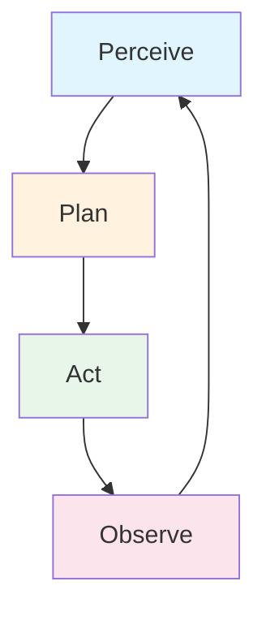
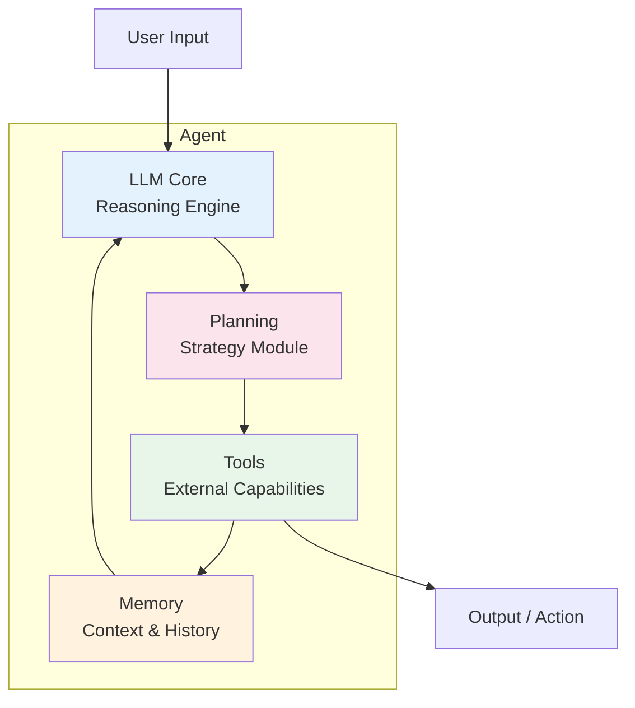

# What Are AI Agents?

An **AI Agent** is an autonomous system that perceives its environment, makes decisions, and takes actions to achieve specific goals. Unlike a standalone LLM that simply generates text, an agent **loops**: it observes, thinks, acts, and learns from results.

Think of it like this: an LLM is a brain. An agent is a brain with **hands** (tools), **memory** (context), and **a job description** (goals).

---

## The Agent Loop

Every agent follows a core loop:



1. **Perceive** — Take in the user's request + current context + memory
2. **Plan** — Decide what to do (which tool to use, what to ask, etc.)
3. **Act** — Execute: call a tool, run code, search the web, etc.
4. **Observe** — Look at the result and decide: done? retry? next step?

This loop repeats until the agent achieves its goal or hits a limit.

---

## Anatomy of an Agent



### 1. LLM Core
The reasoning engine. Usually GPT-4o, Claude Sonnet, or Gemini. This is where decisions happen.

### 2. Tools
External capabilities the agent can invoke:
- **Search** — Google, DuckDuckGo, internal search
- **Code execution** — Python, SQL, shell commands
- **APIs** — any REST API (weather, stocks, CRM, etc.)
- **Databases** — query SQL, NoSQL, vector DBs
- **File system** — read, write, process files

### 3. Memory
- **Short-term**: The current conversation context
- **Long-term**: Past interactions stored in a vector database
- **Entity memory**: Facts about users, preferences, recurring entities

### 4. Planning
How the agent decides what to do:
- **ReAct**: Reason then Act (most common)
- **Plan-and-Execute**: Make a full plan first, then execute
- **Reflexion**: Self-reflect and improve after each attempt

---

## Agent vs LLM: The Key Difference

| Aspect | LLM | Agent |
|--------|-----|-------|
| Input → Output | One-shot text generation | Multi-step loop with tool use |
| External tools | None | Can call any tool/API |
| Memory | Only prompt context | Persistent memory across sessions |
| Error handling | None | Retry, fallback, self-correction |
| Cost | Predictable (per token) | Variable (depends on iterations) |
| Use case | Chat, summarization | Research, automation, workflows |

---

## Why Agents Matter in 2026

The **Agentic AI Developer** role is the fastest-growing AI job category in India:

- **Fresher salary**: ₹9-15 LPA
- **Mid-level**: ₹18-30 LPA
- **Senior**: ₹25-50 LPA
- **Global remote**: ₹40-80 LPA+

Companies are moving from "chat with my PDF" (RAG) to "autonomously research, write, and publish" (Agents). The demand for engineers who can build reliable agent systems is near-zero supply.

**Key shifts in 2026:**
1. Frameworks matured: LangGraph v0.4, CrewAI enterprise, AutoGen 1.0 GA
2. Observability: LangSmith, Langfuse — trace every agent step
3. Production patterns: checkpointing, HITL, guardrails, cost control
4. Enterprise adoption: Klarna's AI assistant handles 2.3M conversations

---

## Real-World Analogy

**An agent is like a junior employee** who:
- Receives a task ("Research competitors and write a report")
- Knows what tools to use (Google, Excel, email)
- Remembers what they found yesterday (memory)
- Asks for help when stuck (human-in-the-loop)
- Keeps working until the job is done (autonomy)

---

## A Minimal Agent in Python

```python
import json
from typing import Callable, Dict, List

class Tool:
    def __init__(self, name: str, description: str, func: Callable):
        self.name = name
        self.description = description
        self.func = func

class SimpleAgent:
    def __init__(self, llm_client, tools: List[Tool]):
        self.llm = llm_client
        self.tools = {t.name: t for t in tools}
        self.memory = []
    
    def run(self, query: str, max_steps: int = 5) -> str:
        self.memory.append({"role": "user", "content": query})
        
        for step in range(max_steps):
            # Build prompt with tool descriptions
            tool_desc = "\n".join(
                f"- {name}: {tool.description}"
                for name, tool in self.tools.items()
            )
            
            prompt = f"""You are an agent. You have access to these tools:
{tool_desc}

Respond in one of these formats:
1. ACTION: tool_name | {{"param": "value"}}
2. FINAL: your final answer

History: {json.dumps(self.memory)}

What do you do next?"""

            response = self.llm.complete(prompt)
            self.memory.append({"role": "agent", "content": response})
            
            if response.startswith("FINAL:"):
                return response.replace("FINAL:", "").strip()
            
            if response.startswith("ACTION:"):
                parts = response.replace("ACTION:", "").strip().split(" | ")
                tool_name = parts[0].strip()
                args = json.loads(parts[1]) if len(parts) > 1 else {}
                
                if tool_name in self.tools:
                    result = self.tools[tool_name].func(**args)
                    self.memory.append({"role": "tool", "content": str(result)})
                else:
                    self.memory.append({"role": "tool", "content": f"Error: Tool {tool_name} not found"})
        
        return "Max steps reached. Here's what I found:\n" + json.dumps(self.memory, indent=2)

# Usage
import os
from openai import OpenAI

client = OpenAI(api_key=os.getenv("OPENAI_API_KEY"))

def search_web(query: str) -> str:
    """Simulated web search"""
    return f"Search results for: {query}"

def calculate(expression: str) -> float:
    """Evaluate math expression"""
    return eval(expression)

agent = SimpleAgent(
    llm_client=client,
    tools=[
        Tool("search", "Search the web for information", search_web),
        Tool("calculate", "Evaluate mathematical expressions", calculate),
    ]
)

result = agent.run("What is the population of India divided by the population of USA?")
print(result)
```

This is a simplified version. Real agents use frameworks like LangGraph or CrewAI that handle the loop, error recovery, and state management for you.

---

## What's Next

- Learn the [6 architecture patterns](./02-agent-architecture-patterns.md) agents use
- Understand [core concepts](./03-core-concepts.md): tools, memory, planning
- See [how agents differ from RAG](./04-agent-vs-llm-vs-rag.md)
- Explore the [6 types of agents](./05-types-of-agents.md)
