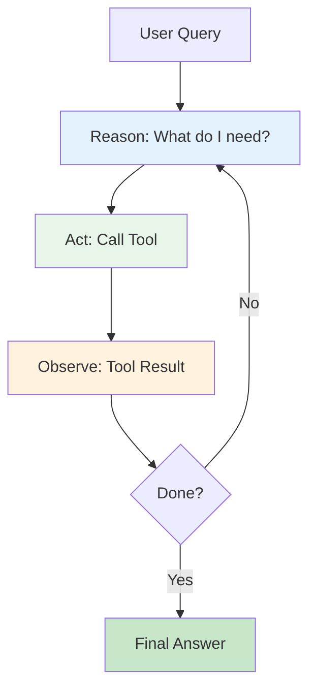
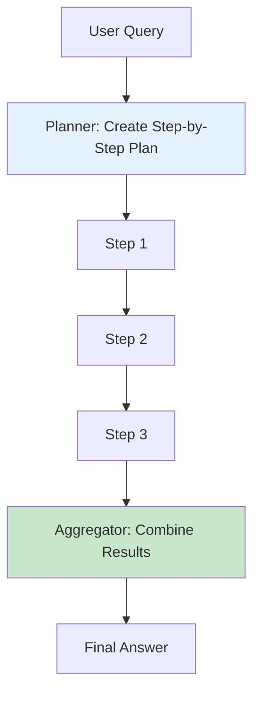
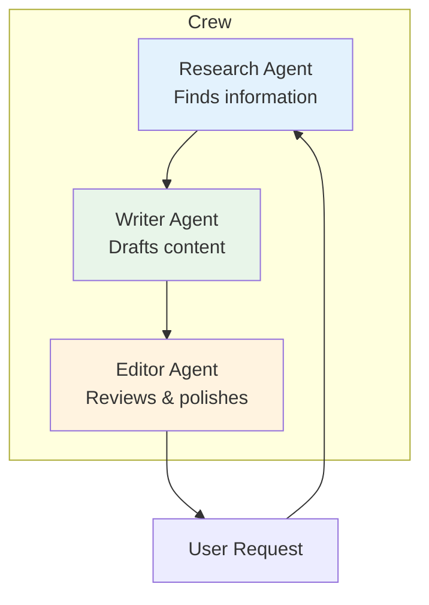
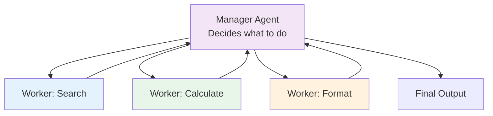
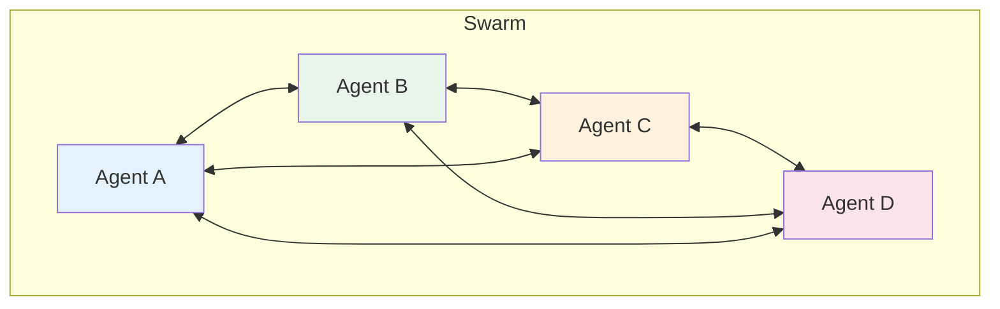
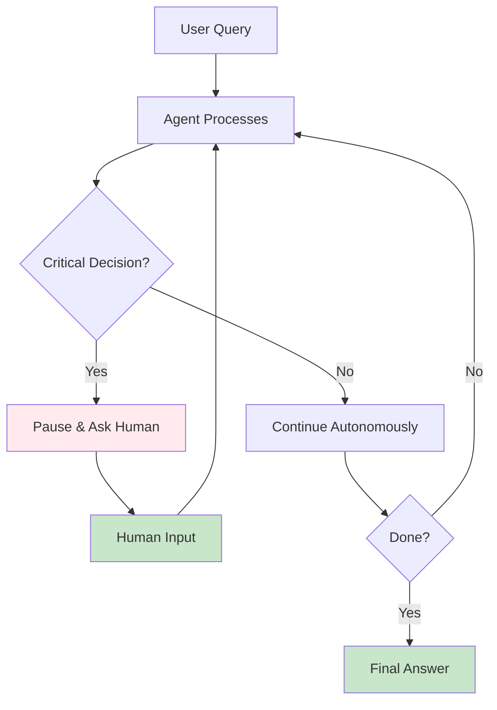
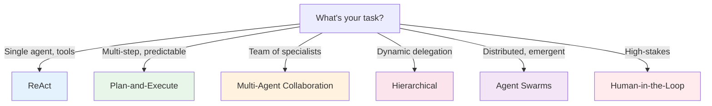

# Agent Architecture Patterns

Agents can be organized in different ways depending on the problem. These 6 patterns cover 95% of production agent systems.

---

## 1. ReAct (Reasoning + Acting)

The foundational pattern. The agent **reasons** about what to do, then **acts** by calling a tool.

**When to use**: Simple tasks with clear tool sequences (search → summarize, calculate → format).

**Pros**: Simple, interpretable, works with any LLM.
**Cons**: Can get stuck in loops, no parallel execution.

---

## 2. Plan-and-Execute

The agent first creates a **plan**, then executes each step systematically.

**When to use**: Complex multi-step tasks where planning upfront saves tokens (research reports, data pipelines).

**Pros**: Efficient, predictable cost, easy to debug.
**Cons**: Rigid — if a step fails, the whole plan may need revision.

---

## 3. Multi-Agent Collaboration

Multiple agents with **different roles** work together, like a team.

**When to use**: Tasks that naturally decompose into specialist roles (content creation, research, code review).

**Pros**: Specialized expertise per agent, parallel work possible.
**Cons**: Coordination overhead, more tokens, complex debugging.

**Framework**: CrewAI is built for this pattern.

---

## 4. Hierarchical Agents

A **manager agent** delegates to **worker agents**, like an org chart.

**When to use**: Complex workflows where a coordinator needs to dynamically assign work (customer support routing, project management).

**Pros**: Dynamic task assignment, fault isolation, easy to scale.
**Cons**: Single point of failure (manager), latency from coordination.

**Framework**: CrewAI (hierarchical process), LangGraph (conditional routing).

---

## 5. Agent Swarms

Agents are **peers** — no manager. They communicate via a shared message bus.

**When to use**: Distributed problem solving, emergent behavior desired, no single coordinator needed.

**Pros**: Fault tolerant, emergent intelligence, highly parallel.
**Cons**: Unpredictable, hard to debug, token-heavy.

**Framework**: AutoGen (group chat), custom implementations.

---

## 6. Human-in-the-Loop (HITL)

The agent **pauses and asks a human** at critical decision points.

**When to use**: High-stakes decisions (financial transactions, medical advice, content approval), learning phase of agent deployment.

**Pros**: Safety, builds trust, handles edge cases.
**Cons**: Latency, requires human availability.

**Framework**: LangGraph (native HITL with checkpoints), CrewAI (task-level human input).

---

## Pattern Selection Guide

| Pattern | Complexity | Token Cost | Latency | Best For |
|---------|-----------|------------|---------|----------|
| ReAct | Low | Medium | Medium | Simple tool use |
| Plan-and-Execute | Medium | Low | Medium | Predictable workflows |
| Multi-Agent | Medium | High | High | Specialist teams |
| Hierarchical | High | High | High | Dynamic coordination |
| Swarms | High | Very High | Medium | Distributed problems |
| HITL | Medium | Medium | Very High | High-stakes decisions |

---

## Combining Patterns

Real systems often combine patterns:

- **Hierarchical + HITL**: Manager delegates, human approves final output
- **Plan-and-Execute + Multi-Agent**: Plan created centrally, executed by specialist agents
- **ReAct + HITL**: Simple agent that asks for clarification when uncertain

Start with **ReAct** for simple agents, add **HITL** for safety, then scale to **Multi-Agent** or **Hierarchical** as complexity grows.
