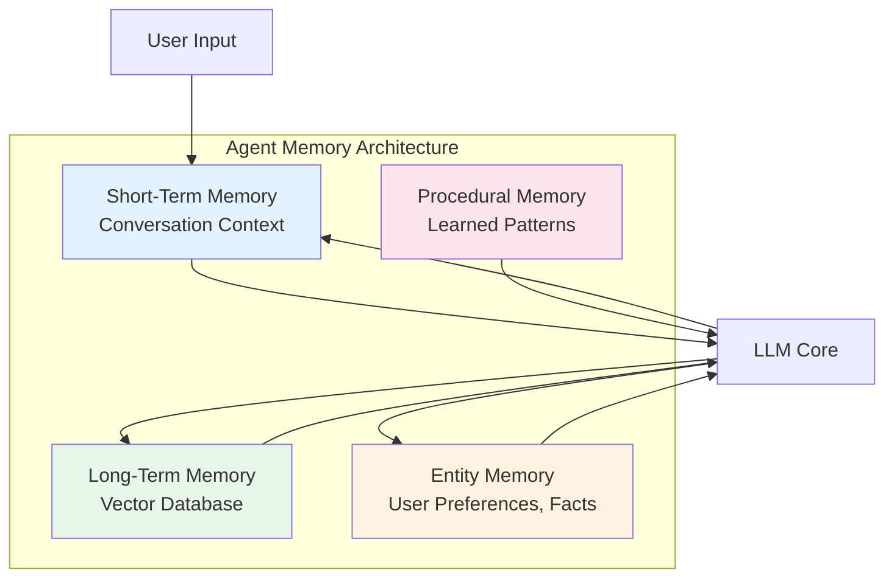
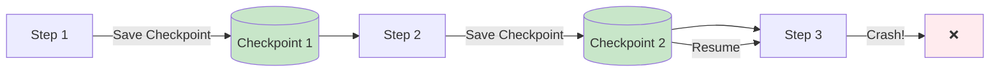

# Core Concepts

These are the building blocks every agent engineer must understand deeply.

---

## 1. Tool Use / Function Calling

Tools are how agents interact with the outside world. Without tools, an agent is just a chatbot.

### How It Works

The LLM generates a structured JSON object specifying which tool to call and with what arguments:

```json
{
  "tool": "search_web",
  "arguments": {
    "query": "population of India 2026"
  }
}
```

### Defining Tools (OpenAI Format)

```python
from typing import Dict, Any

def search_web(query: str) -> str:
    """Search the web for information."""
    # Implementation
    return f"Results for: {query}"

def calculate(expression: str) -> float:
    """Evaluate a mathematical expression."""
    return eval(expression)

# Tool schema for the LLM
tools = [
    {
        "type": "function",
        "function": {
            "name": "search_web",
            "description": "Search the web for current information",
            "parameters": {
                "type": "object",
                "properties": {
                    "query": {
                        "type": "string",
                        "description": "The search query"
                    }
                },
                "required": ["query"]
            }
        }
    },
    {
        "type": "function",
        "function": {
            "name": "calculate",
            "description": "Evaluate a mathematical expression",
            "parameters": {
                "type": "object",
                "properties": {
                    "expression": {
                        "type": "string",
                        "description": "Math expression to evaluate"
                    }
                },
                "required": ["expression"]
            }
        }
    }
]

# Usage with OpenAI
response = client.chat.completions.create(
    model="gpt-4o",
    messages=messages,
    tools=tools,
    tool_choice="auto"
)
```

### Tool Design Best Practices

1. **Descriptive names**: `search_company_info` not `tool1`
2. **Clear descriptions**: The LLM uses these to decide which tool to use
3. **Specific parameters**: Avoid broad `query` params when more specific ones exist
4. **Error handling**: Tools should return structured errors, not crash
5. **Idempotency**: Calling a tool twice should be safe

---

## 2. Memory Systems

Agents need memory to maintain context across interactions and learn from past experiences.

### Types of Memory



### Short-Term Memory (STM)
The conversation history within the current session. Kept in the prompt context.

```python
# Simple implementation
class ShortTermMemory:
    def __init__(self, max_messages: int = 10):
        self.messages = []
        self.max_messages = max_messages
    
    def add(self, role: str, content: str):
        self.messages.append({"role": role, "content": content})
        if len(self.messages) > self.max_messages:
            self.messages = self.messages[-self.max_messages:]
    
    def get_context(self) -> list:
        return self.messages
```

### Long-Term Memory (LTM)
Persistent storage across sessions, usually a vector database.

```python
from sentence_transformers import SentenceTransformer
import numpy as np

class VectorMemory:
    def __init__(self, embedding_model: str = "BAAI/bge-small-en"):
        self.model = SentenceTransformer(embedding_model)
        self.embeddings = []
        self.documents = []
    
    def add(self, text: str, metadata: dict = None):
        embedding = self.model.encode(text)
        self.embeddings.append(embedding)
        self.documents.append({"text": text, "metadata": metadata})
    
    def search(self, query: str, top_k: int = 3) -> list:
        query_embedding = self.model.encode(query)
        scores = [
            np.dot(query_embedding, emb) / (np.linalg.norm(query_embedding) * np.linalg.norm(emb))
            for emb in self.embeddings
        ]
        top_indices = np.argsort(scores)[-top_k:][::-1]
        return [self.documents[i] for i in top_indices]
```

### Entity Memory
Stores facts about entities (users, companies, products) extracted from conversations.

```python
class EntityMemory:
    def __init__(self):
        self.entities = {}  # {entity_name: {attributes}}
    
    def extract_and_store(self, text: str, llm_client):
        """Use LLM to extract entities from text"""
        prompt = f"Extract entities and facts from: {text}\nFormat: ENTITY | ATTRIBUTE | VALUE"
        result = llm_client.complete(prompt)
        # Parse and store...
    
    def get(self, entity: str) -> dict:
        return self.entities.get(entity, {})
```

### Checkpointing
Saving agent state so it can resume after crashes:

```python
import json
from datetime import datetime

class CheckpointManager:
    def __init__(self, storage_path: str = "./checkpoints"):
        self.storage_path = storage_path
    
    def save(self, run_id: str, state: dict):
        filepath = f"{self.storage_path}/{run_id}.json"
        with open(filepath, "w") as f:
            json.dump({
                "timestamp": datetime.now().isoformat(),
                "state": state
            }, f)
    
    def load(self, run_id: str) -> dict:
        filepath = f"{self.storage_path}/{run_id}.json"
        try:
            with open(filepath, "r") as f:
                data = json.load(f)
                return data["state"]
        except FileNotFoundError:
            return None
```

---

## 3. Planning & Reasoning

How agents decide what to do.

### Chain-of-Thought (CoT)
The LLM thinks step by step before answering.

```
Q: If a train travels 60 km/h for 2.5 hours, how far does it go?
A: Let me think step by step.
   First, I know distance = speed × time.
   Speed = 60 km/h, Time = 2.5 hours.
   Distance = 60 × 2.5 = 150 km.
   The answer is 150 km.
```

### Tree-of-Thoughts (ToT)
Explore multiple reasoning paths and pick the best one.

```
Problem: Write a Python function to sort a list.
Path A: Use built-in sorted() — simple, O(n log n)
Path B: Implement quicksort — educational, same complexity
Path C: Implement bubblesort — O(n²), not recommended
→ Evaluate: A is best for production, B for learning.
```

### ReAct (Reasoning + Acting)
Interleave reasoning traces with tool calls.

```
Thought: I need to find India's population. Let me search.
Action: search_web("India population 2026")
Observation: India's population is approximately 1.45 billion.
Thought: Now I need to compare with USA. Let me search again.
Action: search_web("USA population 2026")
Observation: USA population is approximately 340 million.
Thought: Now I can calculate the ratio: 1450/340 = 4.26
Action: calculate("1450 / 340")
Observation: 4.2647...
Final Answer: India's population is approximately 4.26 times that of the USA.
```

---

## 4. Observation & Feedback

After every action, the agent observes the result and decides what to do next.

### The Observation Loop

```python
def run_agent_with_observation(agent, query, max_iterations=10):
    context = {"query": query, "history": []}
    
    for i in range(max_iterations):
        # Agent decides next action
        action = agent.decide(context)
        
        if action.type == "FINISH":
            return action.result
        
        # Execute the action
        try:
            observation = execute_tool(action.tool, action.params)
        except Exception as e:
            observation = f"Error: {str(e)}"
        
        # Add to history
        context["history"].append({
            "step": i,
            "action": action,
            "observation": observation
        })
        
        # Self-correction: did the tool fail? Should we retry?
        if "Error" in observation:
            context["needs_retry"] = True
    
    return "Max iterations reached"
```

### Self-Correction Patterns

1. **Retry with backoff**: Tool failed? Wait and retry with exponential backoff
2. **Fallback tools**: Primary search failed? Try alternative search
3. **Decomposition**: Task too complex? Break into smaller sub-tasks
4. **Human escalation**: Stuck after N retries? Ask a human

---

## 5. Agent State

State is the data structure that carries information through the agent's execution.

### Typed State (Recommended)

```python
from typing import TypedDict, Annotated, List
from langgraph.graph.message import add_messages

class AgentState(TypedDict):
    """Typed state for an agent."""
    messages: Annotated[List[dict], add_messages]
    query: str
    tool_calls: List[dict]
    results: List[str]
    final_answer: str
    iteration: int
    status: str  # "running", "paused", "completed", "error"
```

### Why Typed State Matters

1. **Type safety**: Catch errors at development time
2. **Self-documenting**: The state schema documents the agent's data flow
3. **IDE support**: Autocomplete, type hints, refactoring
4. **Validation**: Pydantic can validate state transitions

---

## 6. Checkpoints & Persistence

Production agents must survive crashes. Checkpoints save state at each step.



### Key Points

- **Granularity**: Save after every tool call, not every token
- **Storage**: SQLite for local, Postgres for production, Redis for speed
- **Cleanup**: Old checkpoints should be cleaned up to save storage
- **Versioning**: State schema changes require migration strategies

LangGraph has **built-in checkpointing** — you just configure a checkpointer (memory, SQLite, or Postgres) and it handles persistence automatically.

---

## Quick Reference

| Concept | What It Is | Key Framework Support |
|---------|-----------|----------------------|
| Tool Use | Calling external functions | All frameworks |
| Memory | Context across interactions | LangGraph (checkpoints), CrewAI (memory) |
| Planning | Deciding what to do | ReAct (all), ToT (custom) |
| Observation | Reading tool outputs | All frameworks |
| State | Data flowing through agent | LangGraph (typed), others (dict) |
| Checkpoints | Crash recovery | LangGraph (built-in) |
