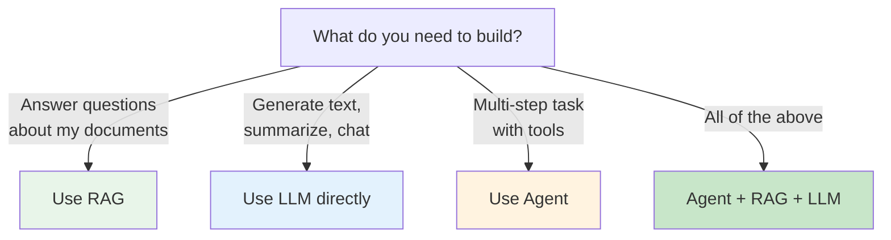
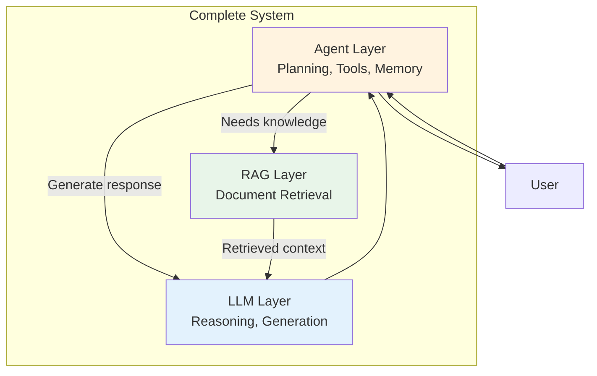

# Agent vs LLM vs RAG

These three technologies are often confused. They solve different problems and **work together** in production systems.

---

## Side-by-Side Comparison

| Dimension | LLM | RAG | Agent |
|-----------|-----|-----|-------|
| **What it does** | Generates text from training data | Retrieves documents, then generates | Plans, uses tools, iterates autonomously |
| **Knowledge** | Static (training cutoff) | Dynamic (your documents) | Dynamic (tools + memory + reasoning) |
| **Tool use** | No | No (retrieval only) | Yes (any tool/API) |
| **Memory** | Prompt only | Vector DB for retrieval | Short-term + long-term + entity |
| **Planning** | None | None | Multi-step reasoning |
| **Error recovery** | None | None | Retry, fallback, self-correction |
| **Cost predictability** | High (per token) | Medium (retrieval + generation) | Low (depends on iterations) |
| **Latency** | Low | Medium | High |
| **Best for** | Chat, summarization | Q&A over documents | Complex workflows, automation |

---

## The Decision Flowchart



---

## How They Work Together

An agent **uses** an LLM for reasoning and **uses** RAG for knowledge retrieval. They are composable layers:



**Real example**: A customer support agent:
1. **Agent** receives: "Where's my order #12345?"
2. **Agent** decides: I need to look up the order
3. **Agent** calls **RAG** tool: searches order database
4. **RAG** retrieves: order details, shipping info
5. **Agent** passes context to **LLM**: "Generate a friendly response with this data"
6. **LLM** generates: "Your order #12345 was shipped on..."
7. **Agent** returns the response to the user

---

## Real-World Examples

### Use RAG (Not an Agent)
> "I want to upload PDFs and ask questions about them"

This is pure RAG. No planning, no tools, no iteration. Just: embed documents → retrieve relevant chunks → generate answer.

### Use LLM Directly (Not RAG or Agent)
> "I want a chatbot that helps with creative writing"

The LLM uses its training knowledge. No external documents, no tool calls. Just conversation.

### Use an Agent
> "Research my top 5 competitors, analyze their pricing, and write a comparison report"

This requires:
- **Planning**: Break into search, analysis, writing steps
- **Tool use**: Web search, possibly scraping
- **Memory**: Remember findings across steps
- **Iteration**: Search → analyze → write → review

### Use All Three
> "Build me an AI assistant for my SaaS product that can answer questions from docs, check user accounts, and process refunds"

- **RAG**: Answer questions from documentation
- **Agent**: Route to correct action, handle multi-step workflows
- **LLM**: Generate natural language responses

---

## The Progression

Most engineers learn these in order:

```
LLM API → Prompt Engineering → RAG → Agents → Multi-Agent Systems
```

You already know RAG (ISRA, Readora). Agents are the natural next step.

| Stage | Complexity | Salary Impact (India) |
|-------|-----------|----------------------|
| LLM API usage | Low | Baseline |
| Prompt engineering | Low | +10-15% |
| RAG systems | Medium | +20-30% |
| **Agent systems** | **High** | **+40-60%** |
| Multi-agent production | Very High | +60-100% |

---

## Quick Decision Guide

| If you need... | Use |
|---------------|-----|
| Text generation from training data | LLM |
| Q&A over your documents | RAG |
| Multi-step workflows with tools | Agent |
| All of the above in one system | Agent + RAG + LLM |
| Autonomous task completion | Multi-Agent System |

**The golden rule**: Start with the simplest thing that works. Add complexity only when needed.
