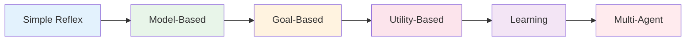

# Types of Agents

Agents exist on a spectrum from simple rule-based systems to complex autonomous multi-agent systems. Understanding this spectrum helps you choose the right approach for your problem.



---

## 1. Simple Reflex Agents

The simplest type. React to current input with predefined rules. No LLM involved.

**How it works**: If condition → then action.

```python
class SimpleReflexAgent:
    """Rule-based agent. No LLM, no memory."""
    
    def __init__(self):
        self.rules = {
            "hello": "Hi there! How can I help?",
            "help": "I can answer questions about our product.",
            "price": "Our pricing starts at $9/month.",
            "bye": "Goodbye! Have a great day!",
        }
    
    def run(self, user_input: str) -> str:
        # Normalize input
        normalized = user_input.lower().strip()
        
        # Check rules in order
        for keyword, response in self.rules.items():
            if keyword in normalized:
                return response
        
        return "I'm not sure I understand. Can you rephrase?"

# Usage
agent = SimpleReflexAgent()
print(agent.run("What's the price?"))  # "Our pricing starts at $9/month."
```

**When to use**: Simple FAQs, predictable inputs, low budget.
**Limitation**: Cannot handle novel situations.

---

## 2. Model-Based Agents

LLM-powered agents that maintain an internal model of the world and reason about it.

**How it works**: Perceive → Update model → Reason → Act.

```python
import os
from openai import OpenAI

class ModelBasedAgent:
    """LLM-powered agent with reasoning."""
    
    def __init__(self):
        self.client = OpenAI(api_key=os.getenv("OPENAI_API_KEY"))
        self.memory = []
    
    def run(self, query: str) -> str:
        # Build context
        self.memory.append({"role": "user", "content": query})
        
        # Use LLM to reason and respond
        response = self.client.chat.completions.create(
            model="gpt-4o-mini",
            messages=[
                {"role": "system", "content": "You are a helpful assistant. Think step by step."},
                *self.memory
            ]
        )
        
        answer = response.choices[0].message.content
        self.memory.append({"role": "assistant", "content": answer})
        
        return answer

# Usage
agent = ModelBasedAgent()
print(agent.run("Explain quantum computing simply"))
```

**When to use**: General Q&A, reasoning tasks, conversational interfaces.
**Limitation**: No tool use, limited to LLM's knowledge.

---

## 3. Goal-Based Agents

Agents with explicit goals that plan actions to achieve them.

**How it works**: Define goal → Plan steps → Execute → Verify.

```python
class GoalBasedAgent:
    """Agent that plans to achieve goals."""
    
    def __init__(self):
        self.client = OpenAI(api_key=os.getenv("OPENAI_API_KEY"))
        self.tools = {}
    
    def add_tool(self, name: str, func, description: str):
        self.tools[name] = {"func": func, "description": description}
    
    def plan(self, goal: str) -> list:
        """Generate a plan to achieve the goal."""
        tool_desc = "\n".join(f"- {n}: {t['description']}" for n, t in self.tools.items())
        
        response = self.client.chat.completions.create(
            model="gpt-4o-mini",
            messages=[{
                "role": "user",
                "content": f"Goal: {goal}\nAvailable tools:\n{tool_desc}\n\nCreate a step-by-step plan. Return as numbered list."
            }]
        )
        
        plan_text = response.choices[0].message.content
        # Parse plan into steps
        steps = [line.strip() for line in plan_text.split("\n") if line.strip() and line[0].isdigit()]
        return steps
    
    def execute(self, goal: str) -> str:
        plan = self.plan(goal)
        results = []
        
        for step in plan:
            # Simple execution: check if any tool should be called
            for tool_name, tool_info in self.tools.items():
                if tool_name in step.lower():
                    result = tool_info["func"]()
                    results.append(f"{step}: {result}")
                    break
            else:
                results.append(f"{step}: (manual step)")
        
        return "\n".join(results)

# Usage
agent = GoalBasedAgent()
agent.add_tool("search", lambda: "Search results...", "Search the web")
agent.add_tool("calculate", lambda: "42", "Perform calculations")

result = agent.execute("Research Python async patterns and calculate performance metrics")
print(result)
```

**When to use**: Task automation, workflows with clear objectives.
**Framework**: Plan-and-Execute pattern in LangGraph.

---

## 4. Utility-Based Agents

Agents that optimize for a specific utility function (cost, quality, speed).

**How it works**: Evaluate actions by utility → Pick the best.

```python
class UtilityBasedAgent:
    """Agent that optimizes for utility."""
    
    def __init__(self):
        self.client = OpenAI(api_key=os.getenv("OPENAI_API_KEY"))
    
    def evaluate_utility(self, action: str, context: dict) -> float:
        """Score an action based on context."""
        score = 0.0
        
        # Prefer faster actions
        if "cache" in action.lower():
            score += 10  # Caching is fast
        if "api_call" in action.lower():
            score -= 5   # API calls are slow
        
        # Prefer cheaper actions
        if "local" in action.lower():
            score += 8   # Local computation is cheap
        if "gpt-4" in action.lower():
            score -= 3   # Expensive model
        
        return score
    
    def decide(self, options: list, context: dict) -> str:
        """Pick the action with highest utility."""
        scored = [(opt, self.evaluate_utility(opt, context)) for opt in options]
        scored.sort(key=lambda x: x[1], reverse=True)
        return scored[0][0]

# Usage
agent = UtilityBasedAgent()
options = [
    "Use cached result",
    "Call GPT-4 for detailed analysis",
    "Use local heuristic",
    "Make API call to external service"
]
best = agent.decide(options, {"urgency": "high", "budget": "low"})
print(f"Best action: {best}")
```

**When to use**: Cost-sensitive applications, latency optimization.
**Real example**: Route simple queries to GPT-3.5, complex ones to GPT-4o.

---

## 5. Learning Agents

Agents that improve over time through feedback.

**How it works**: Act → Evaluate → Learn → Improve.

```python
class LearningAgent:
    """Agent that learns from feedback."""
    
    def __init__(self):
        self.client = OpenAI(api_key=os.getenv("OPENAI_API_KEY"))
        self.success_patterns = {}  # What worked
        self.failure_patterns = {}  # What didn't
    
    def act(self, query: str) -> str:
        # Check if we've seen this pattern before
        for pattern, response in self.success_patterns.items():
            if pattern in query:
                return f"[Learned] {response}"
        
        # Otherwise, use LLM
        response = self.client.chat.completions.create(
            model="gpt-4o-mini",
            messages=[{"role": "user", "content": query}]
        )
        return response.choices[0].message.content
    
    def learn(self, query: str, response: str, feedback: str):
        """Learn from human feedback."""
        if "good" in feedback.lower() or "correct" in feedback.lower():
            self.success_patterns[query] = response
        else:
            self.failure_patterns[query] = response

# Usage
agent = LearningAgent()
response = agent.act("What's our refund policy?")
print(response)

# After getting feedback
agent.learn("What's our refund policy?", response, "Good answer")
```

**When to use**: Long-running systems that encounter repeated patterns.
**Real example**: Customer support that learns common answers over time.

---

## 6. Multi-Agent Systems

Multiple agents collaborating to solve complex problems.

**How it works**: Specialized agents + coordination mechanism.

```python
import asyncio
from typing import List

class SpecializedAgent:
    """An agent with a specific role."""
    
    def __init__(self, name: str, role: str, client):
        self.name = name
        self.role = role
        self.client = client
    
    async def run(self, task: str) -> str:
        response = self.client.chat.completions.create(
            model="gpt-4o-mini",
            messages=[{
                "role": "system",
                "content": f"You are a {self.role}."
            }, {
                "role": "user",
                "content": task
            }]
        )
        return response.choices[0].message.content

class MultiAgentSystem:
    """System of collaborating agents."""
    
    def __init__(self):
        from openai import OpenAI
        import os
        self.client = OpenAI(api_key=os.getenv("OPENAI_API_KEY"))
        
        self.agents = {
            "researcher": SpecializedAgent("Researcher", "research analyst", self.client),
            "writer": SpecializedAgent("Writer", "technical writer", self.client),
            "editor": SpecializedAgent("Editor", "content editor", self.client),
        }
    
    async def run(self, topic: str) -> dict:
        # Step 1: Research
        research = await self.agents["researcher"].run(
            f"Research {topic}. Find key facts, statistics, and trends."
        )
        
        # Step 2: Write
        draft = await self.agents["writer"].run(
            f"Write a blog post about {topic} using this research:\n{research}"
        )
        
        # Step 3: Edit
        final = await self.agents["editor"].run(
            f"Edit and improve this draft:\n{draft}"
        )
        
        return {
            "research": research,
            "draft": draft,
            "final": final
        }

# Usage
async def main():
    system = MultiAgentSystem()
    result = await system.run("AI Agents in 2026")
    print(result["final"])

asyncio.run(main())
```

**When to use**: Complex tasks requiring multiple expertise areas.
**Framework**: CrewAI, AutoGen, LangGraph (multi-agent graphs).

---

## Comparison Summary

| Type | LLM? | Tools? | Planning? | Learning? | Multi-Agent? | Complexity |
|------|------|--------|-----------|-----------|--------------|------------|
| Simple Reflex | No | No | No | No | No | Low |
| Model-Based | Yes | No | No | No | No | Low |
| Goal-Based | Yes | Yes | Yes | No | No | Medium |
| Utility-Based | Yes | Yes | Yes | No | No | Medium |
| Learning | Yes | Yes | Yes | Yes | No | High |
| Multi-Agent | Yes | Yes | Yes | Optional | Yes | High |

---

## How to Choose

1. **Start simple**: Begin with a Model-Based agent (LLM + memory)
2. **Add tools**: When you need external data → Goal-Based
3. **Optimize**: When cost/latency matters → Utility-Based
4. **Scale**: When one agent isn't enough → Multi-Agent
5. **Improve**: When you see repeated patterns → Learning

Most production systems are **Goal-Based** or **Multi-Agent**. Start there.
