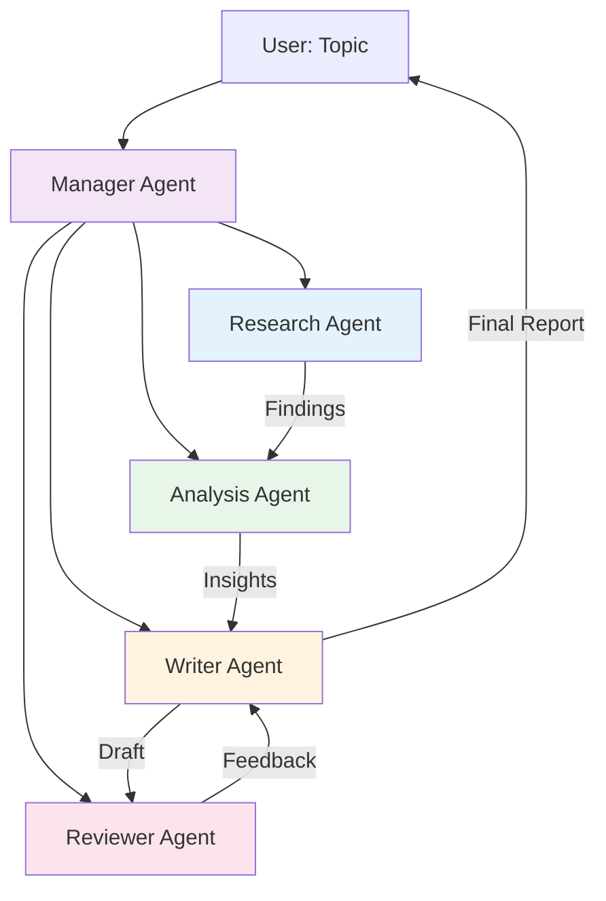
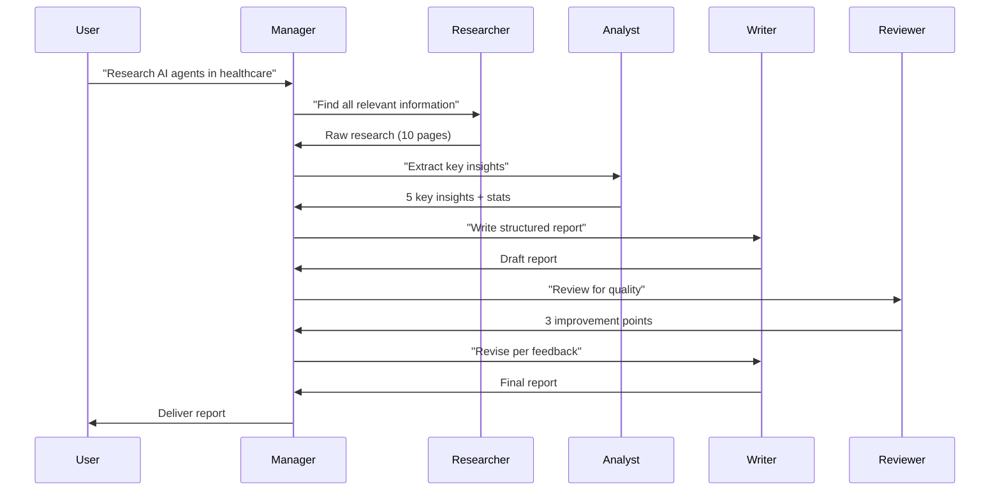

# Project 1: Multi-Agent Research Assistant

A crew of agents that research any topic, synthesize findings, and produce a structured report.

**Framework**: CrewAI | **Pattern**: Hierarchical Multi-Agent | **Difficulty**: Intermediate

---

## Overview

Give this system a topic, and it will:
1. **Research** the topic using web search
2. **Analyze** the findings for key insights
3. **Write** a structured report
4. **Review** the report for quality

All autonomously, with a manager coordinating the work.

### Demo Output

```
Input: "AI agents in healthcare 2026"

Output: A comprehensive report with:
- Executive summary
- Key trends and statistics
- Notable companies and products
- Regulatory considerations
- Future outlook
- Sources cited
```

---

## Architecture



### Sequence Diagram



---

## Learning Objectives

- Multi-agent orchestration with CrewAI
- Role definition (backstory, goal, task)
- Task delegation and dependencies
- Process management (sequential vs hierarchical)
- Tool assignment to specific agents
- Output formatting and quality control

---

## Tech Stack

| Component | Technology | Purpose |
|-----------|-----------|---------|
| Framework | CrewAI | Multi-agent orchestration |
| LLM | GPT-4o / Claude Sonnet | Agent reasoning |
| Search | DuckDuckGo API | Web research |
| Output | Markdown | Report format |
| Deployment | Docker | Containerization |

---

## Folder Structure

```
01-research-assistant/
├── src/
│   ├── __init__.py
│   ├── main.py              # Entry point
│   ├── crew.py              # Crew definition
│   ├── agents.py            # Agent definitions
│   ├── tasks.py             # Task definitions
│   ├── tools.py             # Custom tools
│   └── config.py            # Settings
├── reports/                 # Generated reports
├── tests/
│   ├── test_agents.py
│   └── test_crew.py
├── Dockerfile
├── docker-compose.yml
├── requirements.txt
├── .env.example
└── README.md
```

---

## Key Implementation

### 1. Agent Definitions (src/agents.py)

```python
from crewai import Agent
from crewai_tools import DuckDuckGoSearchTool

search_tool = DuckDuckGoSearchTool()

researcher = Agent(
    role="Senior Research Analyst",
    goal="Find comprehensive, accurate information on any topic",
    backstory="""You are an expert research analyst with 10 years of experience
    in finding and synthesizing information from multiple sources. You are
    thorough, fact-check everything, and always cite your sources.""",
    tools=[search_tool],
    verbose=True,
    allow_delegation=False,
)

analyst = Agent(
    role="Data Analyst",
    goal="Extract key insights and patterns from research data",
    backstory="""You are a skilled data analyst who can identify trends,
    patterns, and actionable insights from raw research. You think critically
    and question assumptions.""",
    verbose=True,
    allow_delegation=False,
)

writer = Agent(
    role="Technical Writer",
    goal="Write clear, structured, engaging reports",
    backstory="""You are an award-winning technical writer who can make
    complex topics accessible. You write in a professional but engaging tone.""",
    verbose=True,
    allow_delegation=False,
)

reviewer = Agent(
    role="Quality Reviewer",
    goal="Ensure reports are accurate, complete, and well-written",
    backstory="""You are a meticulous editor who ensures every report meets
    the highest standards of accuracy and clarity.""",
    verbose=True,
    allow_delegation=False,
)
```

### 2. Task Definitions (src/tasks.py)

```python
from crewai import Task

def create_research_task(topic: str, agent) -> Task:
    return Task(
        description=f"""Research the topic '{topic}' thoroughly.
        
        Your research should cover:
        1. Current state and key developments
        2. Major players and companies
        3. Statistics and market data
        4. Recent news and breakthroughs
        5. Challenges and limitations
        
        Use web search to find current information.
        Compile all findings in a structured format.""",
        expected_output="""A comprehensive research document with:
        - At least 10 key findings
        - Relevant statistics with sources
        - Company/product mentions
        - Recent developments (2024-2026)""",
        agent=agent,
    )

def create_analysis_task(topic: str, agent, context_task) -> Task:
    return Task(
        description=f"""Analyze the research on '{topic}' and extract:
        
        1. Top 5 key insights
        2. Industry trends and direction
        3. Opportunities and threats
        4. Comparative analysis (if applicable)
        
        Think critically. Question assumptions. Identify what's missing.""",
        expected_output="""An analysis document with:
        - 5 key insights with supporting evidence
        - Trend analysis
        - SWOT or comparative framework""",
        agent=agent,
        context=[context_task],
    )

def create_writing_task(topic: str, agent, context_task) -> Task:
    return Task(
        description=f"""Write a professional report on '{topic}' using the
        research and analysis provided.
        
        Structure:
        1. Executive Summary (3-4 bullet points)
        2. Introduction
        3. Key Findings (with subsections)
        4. Analysis and Insights
        5. Future Outlook
        6. Conclusion
        7. Sources
        
        Use markdown formatting. Include tables where relevant.""",
        expected_output="""A well-structured markdown report of 1500+ words
        with proper headings, tables, and source citations.""",
        agent=agent,
        context=[context_task],
        output_file=f"reports/{topic.replace(' ', '_').lower()}_report.md",
    )

def create_review_task(topic: str, agent, context_task) -> Task:
    return Task(
        description=f"""Review the report on '{topic}' for:
        
        1. Factual accuracy
        2. Completeness (anything missing?)
        3. Clarity and readability
        4. Source citations
        5. Grammar and style
        
        Provide specific feedback and suggest improvements.""",
        expected_output="""A review document with:
        - Overall quality rating (1-10)
        - Specific issues found
        - Suggested improvements
        - Revised sections if needed""",
        agent=agent,
        context=[context_task],
    )
```

### 3. Crew Assembly (src/crew.py)

```python
from crewai import Crew, Process
from src.agents import researcher, analyst, writer, reviewer
from src.tasks import (
    create_research_task,
    create_analysis_task,
    create_writing_task,
    create_review_task,
)

def create_research_crew(topic: str):
    # Create tasks
    research_task = create_research_task(topic, researcher)
    analysis_task = create_analysis_task(topic, analyst, research_task)
    writing_task = create_writing_task(topic, writer, analysis_task)
    review_task = create_review_task(topic, reviewer, writing_task)
    
    # Assemble crew
    crew = Crew(
        agents=[researcher, analyst, writer, reviewer],
        tasks=[research_task, analysis_task, writing_task, review_task],
        process=Process.sequential,
        verbose=True,
        memory=True,  # Enable memory for context sharing
    )
    
    return crew

# For complex topics, use hierarchical process
def create_hierarchical_crew(topic: str):
    from crewai import Agent
    
    manager = Agent(
        role="Project Manager",
        goal="Coordinate the research team efficiently",
        backstory="An experienced project manager who ensures quality deliverables.",
        allow_delegation=True,
    )
    
    crew = Crew(
        agents=[researcher, analyst, writer, reviewer],
        tasks=[
            create_research_task(topic, researcher),
            create_analysis_task(topic, analyst, None),
            create_writing_task(topic, writer, None),
        ],
        process=Process.hierarchical,
        manager_agent=manager,
        verbose=True,
    )
    
    return crew
```

### 4. Entry Point (src/main.py)

```python
#!/usr/bin/env python3
"""Research Assistant — Multi-Agent Research System"""

import os
import sys
from pathlib import Path

# Add src to path
sys.path.insert(0, str(Path(__file__).parent))

from crew import create_research_crew

def main():
    if len(sys.argv) < 2:
        topic = input("Enter research topic: ")
    else:
        topic = " ".join(sys.argv[1:])
    
    print(f"\n{'='*60}")
    print(f"Researching: {topic}")
    print(f"{'='*60}\n")
    
    crew = create_research_crew(topic)
    result = crew.kickoff()
    
    print(f"\n{'='*60}")
    print("RESEARCH COMPLETE")
    print(f"{'='*60}")
    print(result)
    
    # Save report
    os.makedirs("reports", exist_ok=True)
    report_path = f"reports/{topic.replace(' ', '_').lower()}_report.md"
    with open(report_path, "w") as f:
        f.write(str(result))
    print(f"\nReport saved to: {report_path}")

if __name__ == "__main__":
    main()
```

---

## Running the Project

```bash
# Setup
cd 03-projects/01-research-assistant
python -m venv venv
source venv/bin/activate
pip install -r requirements.txt

# Set API keys
cp .env.example .env
# Edit .env with your OpenAI API key

# Run
python src/main.py "AI agents in healthcare 2026"

# Or with Docker
docker-compose up --build
```

---

## Expected Output

```
============================================================
Researching: AI agents in healthcare 2026
============================================================

[Research Agent]: Searching for information...
[Research Agent]: Found 15 relevant sources

[Analysis Agent]: Extracting key insights...
[Analysis Agent]: Identified 5 major trends

[Writer Agent]: Writing report...
[Writer Agent]: Report complete: 2000 words

[Reviewer Agent]: Reviewing...
[Reviewer Agent]: Quality score: 9/10

============================================================
RESEARCH COMPLETE
============================================================

# AI Agents in Healthcare: 2026 Report

## Executive Summary
- The healthcare AI agent market is projected to reach $8.4B by 2026
...

Report saved to: reports/ai_agents_in_healthcare_2026_report.md
```

---

## Extensions

1. **Add more tools**: arXiv search, PubMed, news APIs
2. **Parallel research**: Multiple research agents working in parallel
3. **PDF output**: Convert markdown to PDF with styling
4. **Slack integration**: Trigger research from Slack commands
5. **Scheduled reports**: Run research weekly on trending topics

---

## Testing

```python
# tests/test_crew.py
import pytest
from src.crew import create_research_crew

def test_crew_creation():
    crew = create_research_crew("test topic")
    assert len(crew.agents) == 4
    assert len(crew.tasks) == 4

def test_crew_execution():
    crew = create_research_crew("Python programming")
    result = crew.kickoff()
    assert result is not None
    assert len(str(result)) > 500
```

---

## Deployment

### Docker

```dockerfile
FROM python:3.11-slim

WORKDIR /app
COPY requirements.txt .
RUN pip install --no-cache-dir -r requirements.txt

COPY src/ ./src/
RUN mkdir -p reports

CMD ["python", "src/main.py"]
```

### API Wrapper

Wrap the crew in a FastAPI endpoint for integration:

```python
from fastapi import FastAPI
from pydantic import BaseModel
from src.crew import create_research_crew

app = FastAPI()

class ResearchRequest(BaseModel):
    topic: str

@app.post("/research")
async def research(request: ResearchRequest):
    crew = create_research_crew(request.topic)
    result = crew.kickoff()
    return {"topic": request.topic, "report": str(result)}
```

---

## What You Learned

- Defining agent roles with backstory, goal, and tools
- Creating task dependencies and context sharing
- Running crews with sequential and hierarchical processes
- Integrating search tools
- Output formatting and file generation
- Containerizing agent applications

**Next**: Build the [Coding Agent](../02-coding-agent/) to learn iterative loops.
