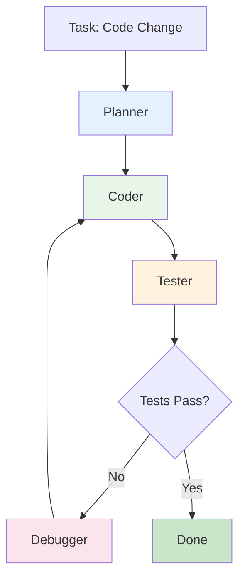
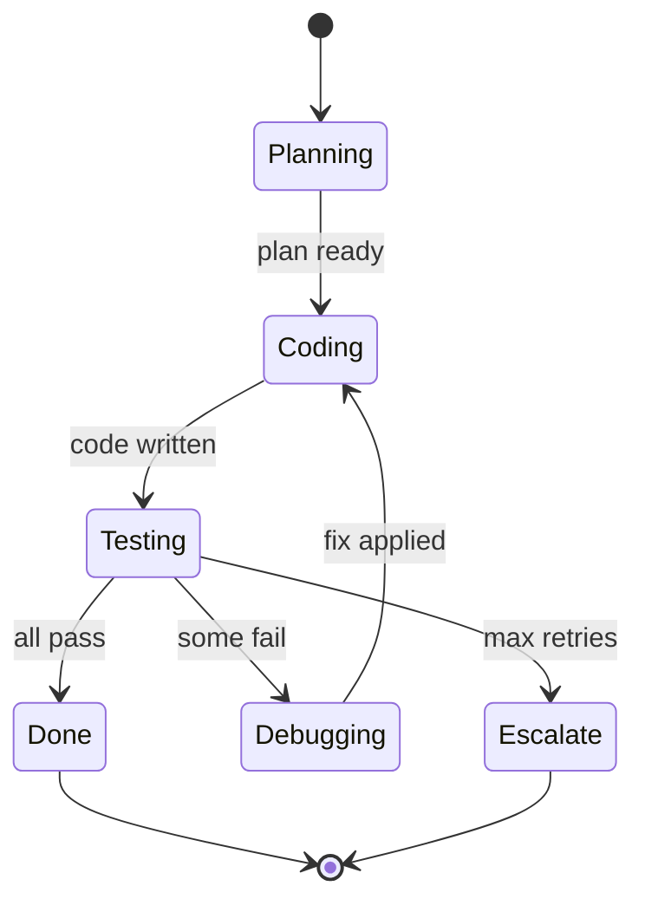

# Project 2: Autonomous Coding Agent

An agent that reads a codebase, understands requirements, plans changes, implements code, runs tests, and debugs until everything passes.

**Framework**: LangGraph | **Pattern**: Iterative State Machine | **Difficulty**: Advanced

---

## Overview

Give this agent a task like "Add user authentication to this FastAPI app", and it will:
1. **Plan** the changes needed
2. **Code** the implementation
3. **Test** by running the test suite
4. **Debug** if tests fail
5. **Repeat** until all tests pass or max iterations reached

### Demo

```
Input: "Add email validation to the User model"

Output:
[Plan] 1. Add email field to User model
       2. Add email validation function
       3. Update tests

[Code] Modified: models/user.py
       Modified: validators/email.py
       Added: tests/test_email_validation.py

[Test] Running tests...
       FAILED: test_invalid_email_format

[Debug] Fixing email regex pattern...

[Test] Running tests...
       PASSED: 12/12

Done! Changes applied successfully.
```

---

## Architecture



### State Machine



---

## Learning Objectives

- LangGraph state machines with cycles
- Iterative agent loops (plan → code → test → debug)
- Error recovery and self-correction
- Code generation and modification
- Running shell commands safely
- State persistence across iterations

---

## Tech Stack

| Component | Technology | Purpose |
|-----------|-----------|---------|
| Framework | LangGraph | State machine orchestration |
| LLM | Claude Sonnet / GPT-4o | Code generation |
| Execution | Docker | Safe code execution |
| VCS | Git | Code versioning |
| Testing | pytest | Test execution |

---

## Folder Structure

```
02-coding-agent/
├── src/
│   ├── __init__.py
│   ├── main.py              # Entry point
│   ├── graph.py             # LangGraph definition
│   ├── nodes.py             # Graph nodes (planner, coder, tester, debugger)
│   ├── state.py             # Typed state definition
│   ├── tools.py             # Code editing tools
│   ├── sandbox.py           # Docker sandbox for execution
│   └── config.py            # Settings
├── templates/               # Code templates
├── tests/
│   ├── test_graph.py
│   └── test_nodes.py
├── Dockerfile
├── docker-compose.yml
├── requirements.txt
├── .env.example
└── README.md
```

---

## Key Implementation

### 1. State Definition (src/state.py)

```python
from typing import TypedDict, Annotated, List, Optional
from langgraph.graph.message import add_messages

class CodingState(TypedDict):
    """State for the coding agent."""
    task: str                          # The coding task
    plan: List[str]                    # Planned steps
    current_step: int                  # Which step we're on
    code_changes: List[dict]           # Files modified
    test_results: Optional[str]       # Test output
    iteration: int                     # Current iteration
    max_iterations: int               # Stop after this many
    status: str                        # "planning" | "coding" | "testing" | "debugging" | "done" | "escalated"
    messages: Annotated[list, add_messages]  # Conversation history
```

### 2. Graph Nodes (src/nodes.py)

```python
import os
import subprocess
import json
from langchain_openai import ChatOpenAI

llm = ChatOpenAI(model="gpt-4o", api_key=os.getenv("OPENAI_API_KEY"))

def planner(state: CodingState) -> CodingState:
    """Create a plan for the coding task."""
    task = state["task"]
    
    prompt = f"""You are a senior software architect. Create a step-by-step plan
    to implement this task:
    
    Task: {task}
    
    Return your plan as a JSON list of steps. Each step should be a clear,
    actionable instruction.
    
    Example: ["Add email field to User model", "Create validation function", "Update tests"]"""
    
    response = llm.invoke(prompt)
    
    # Parse the plan
    try:
        plan = json.loads(response.content)
    except:
        # Fallback: split by lines
        plan = [line.strip("- ") for line in response.content.split("\n") if line.strip().startswith("-")]
    
    return {
        **state,
        "plan": plan,
        "current_step": 0,
        "status": "planning",
    }

def coder(state: CodingState) -> CodingState:
    """Generate code for the current step."""
    task = state["task"]
    plan = state["plan"]
    current = state["current_step"]
    
    if current >= len(plan):
        return {**state, "status": "testing"}
    
    step = plan[current]
    
    prompt = f"""You are an expert Python developer. Implement this step:
    
    Overall task: {task}
    Current step ({current + 1}/{len(plan)}): {step}
    
    Return the code changes in this format:
    FILE: path/to/file.py
    ```python
    # code here
    ```
    
    Only return the code, no explanations."""
    
    response = llm.invoke(prompt)
    content = response.content
    
    # Parse code changes
    changes = parse_code_changes(content)
    
    # Apply changes (write to files)
    for change in changes:
        apply_code_change(change)
    
    return {
        **state,
        "code_changes": state.get("code_changes", []) + changes,
        "current_step": current + 1,
        "status": "coding" if current + 1 < len(plan) else "testing",
    }

def tester(state: CodingState) -> CodingState:
    """Run tests and capture results."""
    try:
        result = subprocess.run(
            ["pytest", "-v"],
            capture_output=True,
            text=True,
            timeout=60,
        )
        
        output = result.stdout + "\n" + result.stderr
        passed = result.returncode == 0
        
        return {
            **state,
            "test_results": output,
            "status": "done" if passed else "debugging",
            "iteration": state["iteration"] + 1,
        }
    except subprocess.TimeoutExpired:
        return {
            **state,
            "test_results": "Tests timed out after 60 seconds",
            "status": "debugging",
            "iteration": state["iteration"] + 1,
        }
    except Exception as e:
        return {
            **state,
            "test_results": f"Error running tests: {str(e)}",
            "status": "debugging",
            "iteration": state["iteration"] + 1,
        }

def debugger(state: CodingState) -> CodingState:
    """Analyze test failures and generate fixes."""
    test_results = state["test_results"]
    code_changes = state["code_changes"]
    
    prompt = f"""You are an expert debugger. Analyze these test failures and
    generate fixes:
    
    Test results:
    {test_results}
    
    Recent code changes:
    {json.dumps(code_changes[-3:], indent=2)}
    
    Return the fix in the same format as before:
    FILE: path/to/file.py
    ```python
    # fixed code
    ```"""
    
    response = llm.invoke(prompt)
    changes = parse_code_changes(response.content)
    
    for change in changes:
        apply_code_change(change)
    
    return {
        **state,
        "code_changes": state["code_changes"] + changes,
        "status": "coding",
    }

def escalate(state: CodingState) -> CodingState:
    """Escalate to human when max iterations reached."""
    return {
        **state,
        "status": "escalated",
    }

# Helper functions
def parse_code_changes(content: str) -> List[dict]:
    """Parse code changes from LLM output."""
    changes = []
    import re
    
    pattern = r'FILE:\s*(\S+)\s*```(?:\w+)?\s*(.*?)```'
    matches = re.findall(pattern, content, re.DOTALL)
    
    for filepath, code in matches:
        changes.append({"file": filepath, "code": code.strip()})
    
    return changes

def apply_code_change(change: dict):
    """Apply a code change to the filesystem."""
    filepath = change["file"]
    code = change["code"]
    
    # Ensure directory exists
    os.makedirs(os.path.dirname(filepath), exist_ok=True)
    
    with open(filepath, "w") as f:
        f.write(code)
```

### 3. Graph Assembly (src/graph.py)

```python
from langgraph.graph import StateGraph, END
from src.state import CodingState
from src.nodes import planner, coder, tester, debugger, escalate

def should_continue(state: CodingState) -> str:
    """Decide next node based on state."""
    if state["status"] == "escalated":
        return END
    if state["status"] == "done":
        return END
    if state["status"] == "debugging" and state["iteration"] >= state["max_iterations"]:
        return "escalate"
    if state["status"] == "debugging":
        return "debugger"
    if state["status"] == "testing":
        return "tester"
    if state["status"] in ["planning", "coding"]:
        return "coder"
    return END

def create_coding_graph():
    """Create the coding agent graph."""
    workflow = StateGraph(CodingState)
    
    # Add nodes
    workflow.add_node("planner", planner)
    workflow.add_node("coder", coder)
    workflow.add_node("tester", tester)
    workflow.add_node("debugger", debugger)
    workflow.add_node("escalate", escalate)
    
    # Add edges
    workflow.set_entry_point("planner")
    workflow.add_edge("planner", "coder")
    workflow.add_conditional_edges(
        "coder",
        should_continue,
        {
            "coder": "coder",
            "tester": "tester",
            "debugger": "debugger",
            "escalate": "escalate",
            END: END,
        }
    )
    workflow.add_conditional_edges(
        "tester",
        should_continue,
        {
            "debugger": "debugger",
            "escalate": "escalate",
            END: END,
        }
    )
    workflow.add_edge("debugger", "coder")
    workflow.add_edge("escalate", END)
    
    return workflow.compile()
```

### 4. Entry Point (src/main.py)

```python
#!/usr/bin/env python3
"""Coding Agent — Autonomous Code Implementation"""

import os
import sys
from pathlib import Path

sys.path.insert(0, str(Path(__file__).parent))

from graph import create_coding_graph
from state import CodingState

def main():
    if len(sys.argv) < 2:
        task = input("Enter coding task: ")
    else:
        task = " ".join(sys.argv[1:])
    
    print(f"\n{'='*60}")
    print(f"Task: {task}")
    print(f"{'='*60}\n")
    
    # Initialize state
    initial_state: CodingState = {
        "task": task,
        "plan": [],
        "current_step": 0,
        "code_changes": [],
        "test_results": None,
        "iteration": 0,
        "max_iterations": 5,
        "status": "planning",
        "messages": [],
    }
    
    # Run graph
    graph = create_coding_graph()
    result = graph.invoke(initial_state)
    
    # Display results
    print(f"\n{'='*60}")
    print(f"Status: {result['status']}")
    print(f"Iterations: {result['iteration']}")
    print(f"Steps completed: {result['current_step']}/{len(result['plan'])}")
    
    if result['test_results']:
        print(f"\nLast test results:")
        print(result['test_results'][:500])
    
    if result['status'] == "escalated":
        print("\n⚠️  Max iterations reached. Manual intervention needed.")

if __name__ == "__main__":
    main()
```

---

## Running

```bash
cd 03-projects/02-coding-agent
python -m venv venv && source venv/bin/activate
pip install -r requirements.txt
cp .env.example .env
# Add your API key

python src/main.py "Add email validation to User model"
```

---

## Safety Considerations

⚠️ **This agent writes code and runs tests. Safety measures:**

1. **Docker sandbox**: Run in an isolated container
2. **Git backup**: Commit before running the agent
3. **File restrictions**: Only modify files in the project directory
4. **Test timeout**: Tests timeout after 60 seconds
5. **Max iterations**: Agent stops after N attempts

```python
# Pre-flight safety check
def safety_check():
    assert os.path.exists(".git"), "Must be in a git repo"
    assert subprocess.run(["git", "diff", "--quiet"]).returncode == 0, "Commit changes first"
    return True
```

---

## What You Learned

- LangGraph state machines with cycles
- Conditional routing based on state
- Iterative agent patterns
- Code generation and file manipulation
- Test-driven agent development
- Error recovery and escalation

**Next**: Build the [Support Agent](../03-support-agent/) for conditional routing patterns.
