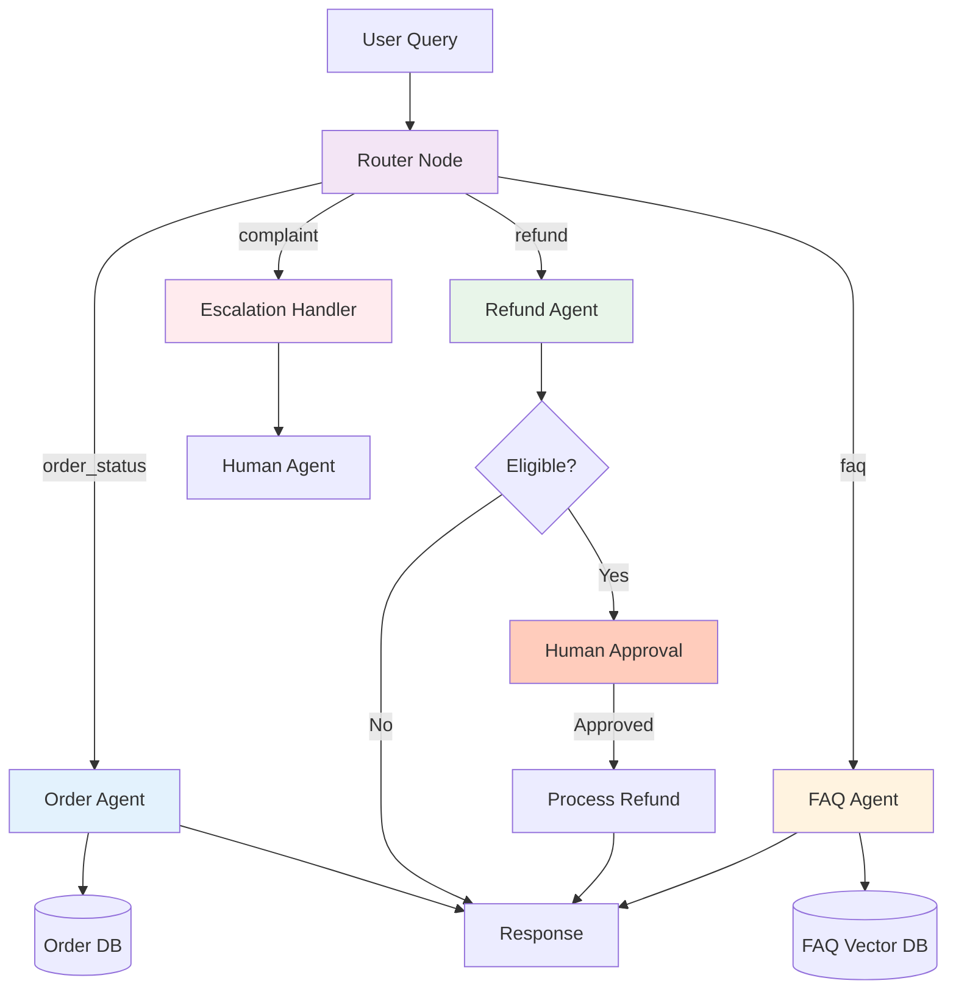

# Project 3: Intelligent Customer Support Agent

An agent that handles customer queries, checks order status, processes refunds, and escalates to humans when needed.

**Framework**: LangGraph | **Pattern**: Conditional Routing + HITL | **Difficulty**: Intermediate

---

## Overview

This agent routes customer queries to the right handler:
- **Order questions** → Order lookup tool → Database
- **Refund requests** → Refund tool → Human approval → Process
- **General questions** → FAQ retrieval → Vector DB
- **Complaints** → Escalation → Human agent

### Demo

```
Customer: "Where is my order #12345?"
→ [Router] Intent: order_status
→ [Order Agent] Query database...
→ Response: "Your order #12345 was shipped on Jan 15. Tracking: ABC123"

Customer: "I want a refund for order #12345"
→ [Router] Intent: refund
→ [Refund Agent] Check eligibility...
→ [HITL] Approve refund? [Human clicks Yes]
→ Response: "Refund of $49.99 processed. Will arrive in 3-5 days."

Customer: "Your service is terrible!"
→ [Router] Intent: complaint
→ [Escalation] Forward to human agent
→ Response: "I'm connecting you with a specialist now..."
```

---

## Architecture



---

## Learning Objectives

- Intent classification and routing
- Database tool integration
- Human-in-the-loop (HITL) implementation
- Vector DB for FAQ retrieval
- Conditional edges in LangGraph
- Multi-turn conversation state

---

## Tech Stack

| Component | Technology | Purpose |
|-----------|-----------|---------|
| Framework | LangGraph | Conditional routing |
| LLM | GPT-4o-mini | Intent classification |
| DB | SQLite / PostgreSQL | Order data |
| Vector DB | ChromaDB / pgvector | FAQ retrieval |
| Web | FastAPI | API endpoints |
| Deployment | Docker + Docker Compose |

---

## Key Implementation

### 1. Router Node

```python
from typing import Literal
from langchain_openai import ChatOpenAI

llm = ChatOpenAI(model="gpt-4o-mini")

def router(state: dict) -> Literal["order", "refund", "faq", "complaint", "escalate"]:
    """Classify intent and route to appropriate handler."""
    query = state["messages"][-1]["content"]
    
    prompt = f"""Classify the customer query into one category:
    - order: Questions about order status, shipping, delivery
    - refund: Refund requests, return policies
    - faq: General questions about products, services
    - complaint: Complaints, negative feedback
    - escalate: Complex issues needing human
    
    Query: {query}
    
    Return only the category name."""
    
    response = llm.invoke(prompt)
    intent = response.content.strip().lower()
    
    # Validate intent
    valid_intents = ["order", "refund", "faq", "complaint", "escalate"]
    return intent if intent in valid_intents else "escalate"
```

### 2. Agent Nodes

```python
def order_agent(state: dict) -> dict:
    """Handle order-related queries."""
    query = state["messages"][-1]["content"]
    
    # Extract order ID
    import re
    order_match = re.search(r'#?(\d{4,})', query)
    order_id = order_match.group(1) if order_match else None
    
    if order_id:
        # Query database
        result = query_order_db(order_id)
        response = f"Order #{order_id}: {result['status']}."
        if result.get("tracking"):
            response += f" Tracking: {result['tracking']}"
    else:
        response = "Could you provide your order number? It looks like #12345."
    
    return {
        **state,
        "messages": state["messages"] + [{"role": "assistant", "content": response}],
    }

def refund_agent(state: dict) -> dict:
    """Handle refund requests with HITL."""
    query = state["messages"][-1]["content"]
    
    # Extract order ID and check eligibility
    import re
    order_match = re.search(r'#?(\d{4,})', query)
    order_id = order_match.group(1) if order_match else None
    
    if not order_id:
        return {
            **state,
            "messages": state["messages"] + [{"role": "assistant", "content": "Please provide your order number for the refund request."}],
        }
    
    # Check eligibility
    order = query_order_db(order_id)
    eligible = order["status"] == "delivered" and order["days_since_delivery"] <= 30
    
    if not eligible:
        return {
            **state,
            "messages": state["messages"] + [{"role": "assistant", "content": f"Order #{order_id} is not eligible for refund. Reason: {order.get('refund_reason', 'Outside return window')}"}],
        }
    
    # Request human approval
    return {
        **state,
        "requires_approval": True,
        "approval_type": "refund",
        "order_id": order_id,
        "amount": order["total"],
    }

def faq_agent(state: dict) -> dict:
    """Answer FAQ using vector search."""
    query = state["messages"][-1]["content"]
    
    # Search FAQ vector DB
    results = search_faq(query, top_k=3)
    
    if results:
        context = "\n\n".join([r["answer"] for r in results])
        
        prompt = f"""Answer the customer's question using this FAQ context:
        
        FAQ Context:
        {context}
        
        Question: {query}
        
        Give a concise, helpful answer."""
        
        response = llm.invoke(prompt).content
    else:
        response = "I couldn't find an exact answer. Let me connect you with a specialist."
    
    return {
        **state,
        "messages": state["messages"] + [{"role": "assistant", "content": response}],
    }
```

### 3. Graph with Conditional Routing

```python
from langgraph.graph import StateGraph, END
from typing import TypedDict, Annotated
from langgraph.graph.message import add_messages

class SupportState(TypedDict):
    messages: Annotated[list, add_messages]
    requires_approval: bool
    approval_type: str
    order_id: str
    amount: float

def create_support_graph():
    workflow = StateGraph(SupportState)
    
    workflow.add_node("router", lambda s: s)  # Router just classifies
    workflow.add_node("order_agent", order_agent)
    workflow.add_node("refund_agent", refund_agent)
    workflow.add_node("faq_agent", faq_agent)
    workflow.add_node("escalation", lambda s: {
        **s,
        "messages": s["messages"] + [{"role": "assistant", "content": "I'm connecting you with a human agent. Please hold..."}],
    })
    workflow.add_node("hitl", lambda s: s)  # HITL pause node
    
    workflow.set_entry_point("router")
    
    # Conditional routing from router
    workflow.add_conditional_edges(
        "router",
        router,
        {
            "order": "order_agent",
            "refund": "refund_agent",
            "faq": "faq_agent",
            "complaint": "escalation",
            "escalate": "escalation",
        }
    )
    
    # All agents go to END
    workflow.add_edge("order_agent", END)
    workflow.add_edge("faq_agent", END)
    workflow.add_edge("escalation", END)
    
    # Refund agent may need HITL
    workflow.add_conditional_edges(
        "refund_agent",
        lambda s: "hitl" if s.get("requires_approval") else END,
        {
            "hitl": "hitl",
            END: END,
        }
    )
    
    return workflow.compile()
```

---

## Running

```bash
cd 03-projects/03-support-agent
pip install -r requirements.txt
cp .env.example .env
python src/main.py

# Test with curl
curl -X POST http://localhost:8000/chat \
  -H "Content-Type: application/json" \
  -d '{"message": "Where is my order #12345?"}'
```

---

## HITL Implementation

For production, the HITL flow works like this:

1. Agent sets `requires_approval: True` in state
2. Graph pauses (checkpoint saves state)
3. Notification sent to human (Slack, email, dashboard)
4. Human reviews and approves/rejects via API
5. State updated, graph resumes
6. Customer gets final response

```python
@app.post("/approve")
async def approve_refund(request: ApprovalRequest):
    # Resume the graph with human decision
    result = await graph.ainvoke(
        state_snapshot,
        {"human_decision": "approved", "approved_by": request.user}
    )
    return {"status": "processed"}
```

---

## What You Learned

- Intent classification with LLM
- Conditional routing in LangGraph
- Database tool integration
- Vector DB for FAQ retrieval
- Human-in-the-loop implementation
- Multi-turn conversation handling

**Next**: Build the [Data Analysis Agent](../04-data-analysis-agent/) for tool chaining.
