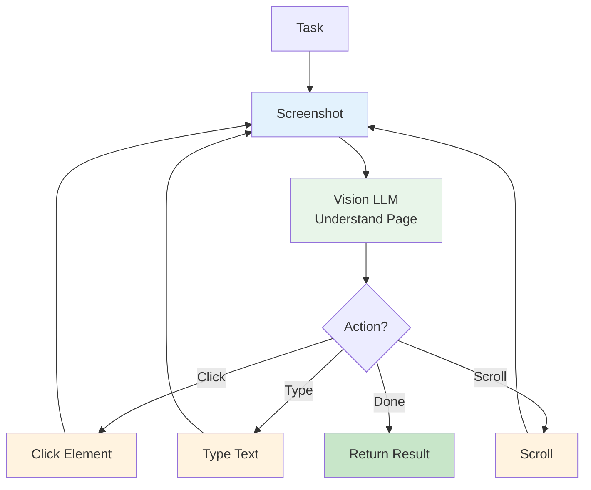

# Project 5: Web Browser Agent

An agent that can navigate websites, fill forms, extract data, and take actions on the web.

**Framework**: LangGraph + Vision LLM | **Pattern**: Web Automation | **Difficulty**: Advanced

---

## Overview

Give the agent a web task in natural language:

```
User: "Go to amazon.com and find the price of iPhone 16"

Agent:
→ Navigates to amazon.com
→ Takes screenshot
→ Understands page layout (vision)
→ Clicks search box, types "iPhone 16"
→ Presses enter
→ Takes screenshot of results
→ Identifies price from screenshot
→ Returns: "iPhone 16 starts at $799 on Amazon"
```

---

## Architecture



---

## Key Implementation

### Browser Tool

```python
from playwright.async_api import async_playwright
from langchain_openai import ChatOpenAI
import base64

llm = ChatOpenAI(model="gpt-4o")  # Vision-capable

class BrowserTool:
    def __init__(self):
        self.browser = None
        self.page = None
    
    async def start(self):
        self.playwright = await async_playwright().start()
        self.browser = await self.playwright.chromium.launch(headless=True)
        self.page = await self.browser.new_page()
    
    async def screenshot(self) -> str:
        """Take screenshot and return base64."""
        screenshot = await self.page.screenshot()
        return base64.b64encode(screenshot).decode()
    
    async def navigate(self, url: str):
        await self.page.goto(url)
    
    async def click(self, description: str):
        """Click element described by text."""
        # Use LLM to find element from screenshot
        screenshot_b64 = await self.screenshot()
        
        prompt = f"""Look at this webpage screenshot. Find the element for: {description}
        Return the approximate coordinates (x, y) to click."""
        
        response = await llm.ainvoke([
            {"type": "text", "text": prompt},
            {"type": "image_url", "image_url": {"url": f"data:image/png;base64,{screenshot_b64}"}}
        ])
        
        # Parse coordinates and click
        # ... implementation
    
    async def type_text(self, text: str):
        await self.page.keyboard.type(text)
    
    async def close(self):
        await self.browser.close()
        await self.playwright.stop()
```

### Agent Loop

```python
from langgraph.graph import StateGraph, END

class BrowserState(dict):
    task: str
    screenshot: str
    action: str
    done: bool
    result: str

async def perceive(state: BrowserState) -> BrowserState:
    """Take screenshot and understand current state."""
    screenshot = await browser.screenshot()
    return {**state, "screenshot": screenshot}

async def decide(state: BrowserState) -> BrowserState:
    """Decide next action based on screenshot."""
    prompt = f"""You are controlling a web browser. Your task: {state['task']}
    
    Based on the current page, what should you do next?
    Respond with: ACTION: navigate|click|type|scroll|done
    DETAILS: ...
    """
    
    response = await llm.ainvoke([
        {"type": "text", "text": prompt},
        {"type": "image_url", "image_url": {"url": f"data:image/png;base64,{state['screenshot']}"}}
    ])
    
    # Parse action
    content = response.content
    action_line = [l for l in content.split("\n") if l.startswith("ACTION:")][0]
    action = action_line.replace("ACTION:", "").strip()
    
    return {**state, "action": action, "done": action == "done"}

async def act(state: BrowserState) -> BrowserState:
    """Execute the decided action."""
    action = state["action"]
    
    if action == "navigate":
        await browser.navigate(state.get("url", "https://google.com"))
    elif action == "click":
        await browser.click(state.get("element", ""))
    elif action == "type":
        await browser.type_text(state.get("text", ""))
    # ... etc
    
    return state

# Build graph
workflow = StateGraph(BrowserState)
workflow.add_node("perceive", perceive)
workflow.add_node("decide", decide)
workflow.add_node("act", act)

workflow.set_entry_point("perceive")
workflow.add_edge("perceive", "decide")
workflow.add_edge("decide", "act")
workflow.add_conditional_edges(
    "act",
    lambda s: END if s["done"] else "perceive",
    {END: END, "perceive": "perceive"}
)

browser_graph = workflow.compile()
```

---

## Running

```bash
cd 03-projects/05-browser-agent
pip install -r requirements.txt
playwright install chromium

python src/main.py "Find iPhone 16 price on Amazon"
```

---

## Safety

⚠️ **Browser agents can access any website. Safety measures:**

1. **URL allowlist**: Only allow specific domains
2. **No auth**: Don't log into accounts
3. **Rate limiting**: Slow down requests
4. **Sandbox**: Run in Docker with network restrictions

```python
ALLOWED_DOMAINS = ["amazon.com", "google.com", "github.com"]

def check_url(url: str) -> bool:
    from urllib.parse import urlparse
    domain = urlparse(url).netloc
    return any(d in domain for d in ALLOWED_DOMAINS)
```

---

## What You Learned

- Web automation with Playwright
- Vision LLM for UI understanding
- Screenshot → action loops
- Dynamic content handling
- Web safety and sandboxing

**Next**: Build the [Autonomous Workflow capstone](../06-autonomous-workflow/).
