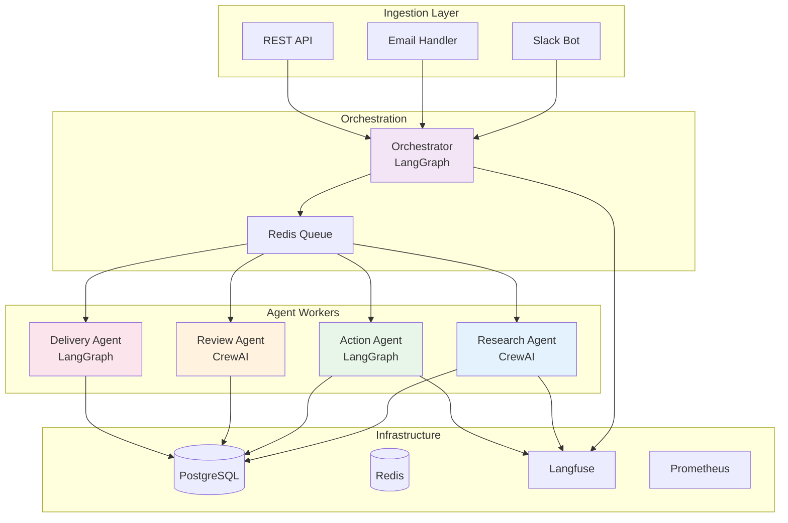
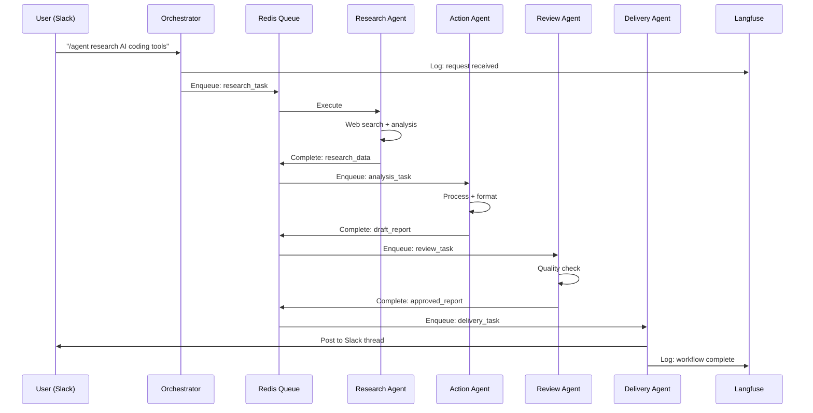

# Project 6: Autonomous Workflow System (Capstone)

A production-grade multi-agent system that handles end-to-end business workflows — from receiving a request via email/Slack, to researching, planning, executing with multiple tools, and delivering results.

**Framework**: LangGraph + CrewAI (mixed) | **Pattern**: Everything Combined | **Difficulty**: Expert

---

## Overview

This is the **capstone project**. It combines everything you've learned:

```
Trigger (Email/Slack/API)
    → Orchestrator receives request
    → Decides which agents to activate
    → Research Agent gathers info
    → Action Agent executes tasks
    → Review Agent checks quality
    → Delivery Agent sends results
    → All traced in Langfuse
    → All deployed on Kubernetes
```

### Example Workflow

```
Slack: "/agent Prepare a competitive analysis of 3 AI coding assistants"

System:
→ Acknowledges request in Slack
→ Research Agent: Searches web, reads docs, finds pricing
→ Analysis Agent: Compares features, pricing, performance
→ Writer Agent: Creates formatted report
→ Review Agent: Checks accuracy and completeness
→ Delivery Agent: Posts report to Slack thread
→ Langfuse: Full trace of all agent interactions
```

---

## Architecture



### Sequence Diagram



---

## Learning Objectives

- Multi-framework integration (LangGraph + CrewAI)
- Async task queue with Celery + Redis
- Multi-agent orchestration at scale
- End-to-end observability
- Production deployment patterns
- Error handling and recovery across agents

---

## Tech Stack

| Layer | Technology | Purpose |
|-------|-----------|---------|
| API | FastAPI | REST endpoints |
| Orchestrator | LangGraph | Workflow engine |
| Workers | Celery + Redis | Async task queue |
| Research | CrewAI | Multi-agent research |
| Action | LangGraph | Tool execution |
| Review | CrewAI | Quality assurance |
| Delivery | LangGraph | Result delivery |
| Database | PostgreSQL | State persistence |
| Cache | Redis | Queue + cache |
| Monitoring | Langfuse | Agent tracing |
| Metrics | Prometheus + Grafana | System metrics |
| Deployment | Docker + Kubernetes | Production |

---

## Folder Structure

```
06-autonomous-workflow/
├── src/
│   ├── __init__.py
│   ├── main.py                  # FastAPI app
│   ├── config.py                # Settings
│   ├── models.py                # DB models
│   ├── orchestrator/
│   │   ├── __init__.py
│   │   ├── graph.py             # Main orchestration graph
│   │   └── state.py             # Shared state
│   ├── agents/
│   │   ├── __init__.py
│   │   ├── research/            # CrewAI research crew
│   │   ├── action/              # LangGraph action agent
│   │   ├── review/              # CrewAI review crew
│   │   └── delivery/            # LangGraph delivery agent
│   ├── tools/
│   │   ├── __init__.py
│   │   ├── web_search.py
│   │   ├── database.py
│   │   ├── slack.py
│   │   └── email.py
│   ├── workers/
│   │   ├── __init__.py
│   │   └── celery_app.py
│   └── monitoring/
│       ├── __init__.py
│       └── langfuse_client.py
├── k8s/                         # Kubernetes manifests
│   ├── namespace.yaml
│   ├── deployment.yaml
│   ├── service.yaml
│   ├── ingress.yaml
│   ├── hpa.yaml
│   └── configmap.yaml
├── docker-compose.yml           # Local development
├── Dockerfile
├── requirements.txt
├── .env.example
└── README.md
```

---

## Key Implementation

### 1. Orchestrator Graph (src/orchestrator/graph.py)

```python
from langgraph.graph import StateGraph, END
from typing import TypedDict, Annotated, List
from langgraph.graph.message import add_messages
import celery

class WorkflowState(TypedDict):
    request_id: str
    source: str  # "slack", "email", "api"
    user_id: str
    request_text: str
    status: str  # "received", "planning", "executing", "reviewing", "delivering", "done"
    plan: List[dict]
    results: dict
    messages: Annotated[list, add_messages]

def orchestrator_graph():
    workflow = StateGraph(WorkflowState)
    
    workflow.add_node("receive", receive_request)
    workflow.add_node("plan", create_plan)
    workflow.add_node("dispatch", dispatch_to_workers)
    workflow.add_node("collect", collect_results)
    workflow.add_node("review", review_output)
    workflow.add_node("deliver", deliver_result)
    
    workflow.set_entry_point("receive")
    workflow.add_edge("receive", "plan")
    workflow.add_edge("plan", "dispatch")
    workflow.add_edge("dispatch", "collect")
    workflow.add_conditional_edges(
        "collect",
        lambda s: "review" if s["status"] == "executing" else "dispatch",
        {"review": "review", "dispatch": "dispatch"}
    )
    workflow.add_edge("review", "deliver")
    workflow.add_edge("deliver", END)
    
    return workflow.compile()

def receive_request(state: WorkflowState):
    """Process incoming request."""
    return {**state, "status": "planning"}

def create_plan(state: WorkflowState):
    """Create execution plan."""
    # Use LLM to break request into sub-tasks
    return {**state, "plan": [...], "status": "executing"}

def dispatch_to_workers(state: WorkflowState):
    """Send tasks to Celery workers."""
    for task in state["plan"]:
        celery_app.send_task(f"agents.{task['agent']}", args=[task])
    return state

def collect_results(state: WorkflowState):
    """Collect results from workers."""
    # Check Redis for completed tasks
    return {**state, "results": {...}}

def review_output(state: WorkflowState):
    """Quality review."""
    return {**state, "status": "reviewing"}

def deliver_result(state: WorkflowState):
    """Send result to user."""
    # Post to Slack / send email
    return {**state, "status": "done"}
```

### 2. Celery Worker Setup

```python
# src/workers/celery_app.py
from celery import Celery

celery_app = Celery(
    "autonomous_workflow",
    broker="redis://redis:6379/0",
    backend="redis://redis:6379/0",
)

@celery_app.task
def research_task(query: str):
    """Execute research using CrewAI."""
    from src.agents.research.crew import run_research
    return run_research(query)

@celery_app.task
def action_task(instructions: str):
    """Execute action using LangGraph."""
    from src.agents.action.graph import run_action
    return run_action(instructions)
```

### 3. Kubernetes Deployment

```yaml
# k8s/deployment.yaml
apiVersion: apps/v1
kind: Deployment
metadata:
  name: orchestrator
spec:
  replicas: 2
  selector:
    matchLabels:
      app: orchestrator
  template:
    metadata:
      labels:
        app: orchestrator
    spec:
      containers:
      - name: orchestrator
        image: agentic-workflow:latest
        ports:
        - containerPort: 8000
        env:
        - name: DATABASE_URL
          valueFrom:
            secretKeyRef:
              name: db-secret
              key: url
        - name: REDIS_URL
          value: "redis://redis:6379"
        - name: LANGFUSE_PUBLIC_KEY
          valueFrom:
            secretKeyRef:
              name: langfuse-secret
              key: public-key
```

---

## Running Locally

```bash
cd 03-projects/06-autonomous-workflow

# Start infrastructure
docker-compose up -d postgres redis langfuse

# Install dependencies
pip install -r requirements.txt

# Start Celery workers
celery -A src.workers.celery_app worker --loglevel=info

# Start API
uvicorn src.main:app --reload

# Test
curl -X POST http://localhost:8000/workflow \
  -H "Content-Type: application/json" \
  -d '{
    "source": "api",
    "user_id": "user123",
    "request_text": "Research AI agent frameworks and create a comparison report"
  }'
```

---

## Running on Kubernetes

```bash
# Build and push
docker build -t agentic-workflow:latest .
docker push agentic-workflow:latest

# Deploy
kubectl apply -f k8s/

# Check
kubectl get pods -n agentic-workflow
kubectl logs -f deployment/orchestrator -n agentic-workflow
```

---

## Monitoring

### Langfuse Dashboard

All agent interactions are traced:

```python
from langfuse import Langfuse

langfuse = Langfuse(
    public_key=os.getenv("LANGFUSE_PUBLIC_KEY"),
    secret_key=os.getenv("LANGFUSE_SECRET_KEY"),
    host=os.getenv("LANGFUSE_HOST"),
)

# Trace a workflow
trace = langfuse.trace(name="workflow", user_id="user123")

# Trace individual agent runs
span = trace.span(name="research_agent")
span.end(output=research_results)
```

### Prometheus Metrics

```python
from prometheus_client import Counter, Histogram, Gauge

workflow_count = Counter("workflows_total", "Total workflows", ["status"])
agent_latency = Histogram("agent_latency_seconds", "Agent latency", ["agent_name"])
active_workflows = Gauge("active_workflows", "Currently running workflows")
```

---

## What You Learned

- Multi-framework agent systems
- Async task queues with Celery
- Distributed agent orchestration
- Production deployment on Kubernetes
- End-to-end observability
- System design for agent platforms

---

## You're Now Production-Ready

With this capstone complete, you can:
- Design multi-agent systems
- Deploy agents at scale
- Monitor and debug agent behavior
- Handle errors and edge cases
- Build real products with agents

**Next**: Read the [production guides](../../04-production/) for deployment details, then go crack those interviews!
