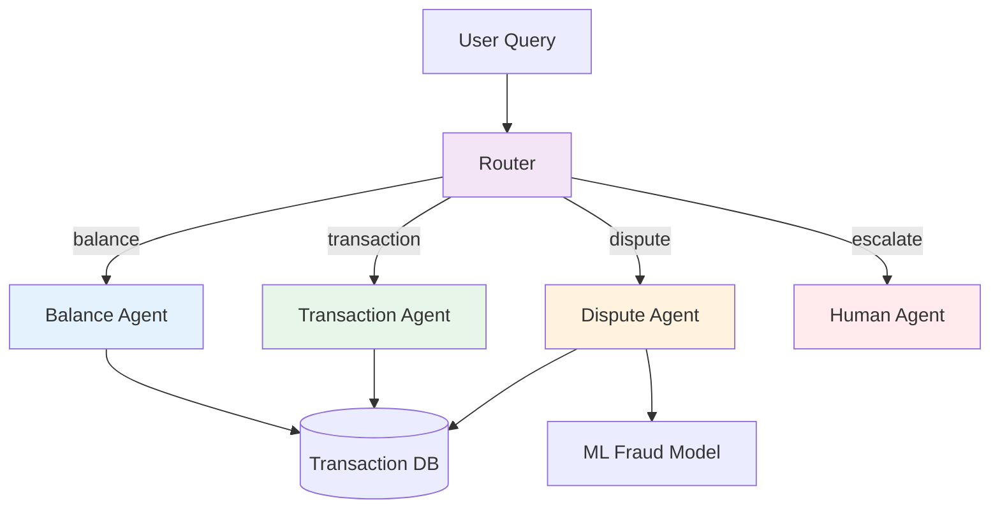

# Production Case Studies

> Real-world agent deployments: what worked, what didn't, and lessons learned.

---

## Case Study 1: Klarna's AI Assistant

### Overview
Klarna deployed an AI assistant that handles customer service inquiries.

### Numbers
- **2.3 million conversations** handled in first month
- **Equivalent to 700 full-time agents**
- **Customer satisfaction**: Same as human agents
- **Resolution time**: 2 minutes vs 11 minutes (human)

### Architecture
- **Multi-agent**: Intent classification → Task execution → Response generation
- **Integrations**: Order database, payment system, shipping APIs
- **HITL**: Complex cases escalated to humans

### Key Lessons
1. **Start narrow**: Focused on post-purchase questions first
2. **Gradual rollout**: 5% → 25% → 100% of queries
3. **HITL from day 1**: Humans review and improve continuously
4. **Measure everything**: CSAT, resolution time, escalation rate

---

## Case Study 2: Replit's AI Coding Agent

### Overview
Replit deployed an AI agent that helps users write and debug code.

### Numbers
- **30% of users** interact with the agent weekly
- **Code acceptance rate**: 45% (industry-leading)
- **Average session**: 3.5 minutes

### Architecture
- **Iterative loop**: Plan → Code → Test → Debug (cycles until done)
- **Sandboxed execution**: Code runs in isolated containers
- **Multi-turn**: Maintains context across conversation

### Key Lessons
1. **Sandbox everything**: Code execution is dangerous
2. **Iterative refinement**: Single-shot rarely works
3. **Context matters**: Understanding the full codebase improves quality
4. **User feedback loop**: Thumbs up/down improves the model

---

## Case Study 3: Indian Fintech — PayEase (Hypothetical)

### Overview
A fintech startup built an agent for customer support and transaction handling.

### Context
- **Company**: PayEase (payments platform, 2M users)
- **Problem**: 50K support tickets/month, 72h average resolution
- **Solution**: Multi-agent support system

### Architecture

### Implementation
- **Framework**: LangGraph for routing, CrewAI for research
- **Models**: Gemini Flash for simple queries, GPT-4o for complex ones
- **Deployment**: GCP Cloud Run + Cloud SQL
- **Monitoring**: Langfuse + custom dashboards

### Results (after 3 months)
- **Resolution time**: 72h → 5 minutes
- **Agent handling rate**: 85% without human
- **Cost savings**: ₹40L/month in support costs
- **CSAT**: Improved from 3.2 to 4.1

### Key Lessons
1. **HITL for financial transactions**: Never fully automate refunds
2. **Indian language support**: Hindi, Tamil, Telugu queries = 40% of volume
3. **Aadhaar/PAN redaction**: PII handling is critical
4. **Gradual rollout**: Start with balance queries, add complexity slowly

---

## Patterns Across All Case Studies

| Pattern | Klarna | Replit | PayEase |
|---------|--------|--------|---------|
| Gradual rollout | Yes | Yes | Yes |
| HITL | Yes | No | Yes |
| Multi-agent | Yes | No | Yes |
| Tool integration | Yes | Yes | Yes |
| Monitoring | Extensive | Extensive | Moderate |
| Iteration | Weekly | Daily | Bi-weekly |

---

## Common Pitfalls

1. **Over-automation**: Trying to automate 100% too early
2. **Poor monitoring**: Not tracking agent behavior
3. **Ignoring edge cases**: Unusual queries break the system
4. **No rollback plan**: Can't revert when things go wrong
5. **Cost blindness**: Not tracking spend per request

---

## Your Turn

As you build your projects, document:
- What architecture you chose and why
- Metrics before and after
- What worked and what didn't
- Cost breakdown

This documentation becomes your portfolio for job interviews.
