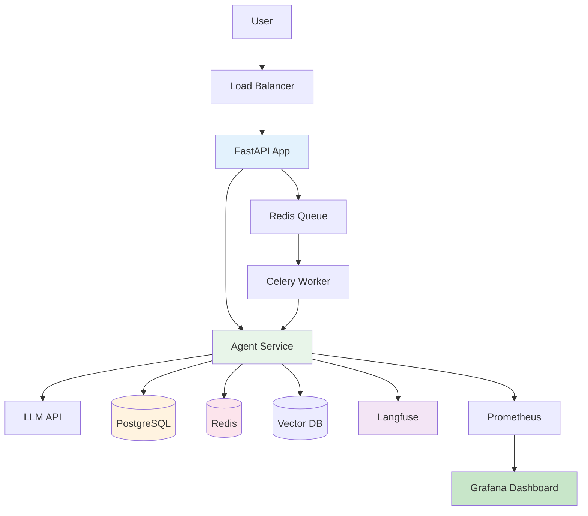

# Production Deployment Guide

> Deploying agents to production is different from prototyping. This section covers everything you need to run agents reliably at scale.

---

## Pre-Deployment Checklist

Before your agent hits production, verify every item:

### Critical (Do Not Skip)

- [ ] **Containerized**: Dockerfile + docker-compose working
- [ ] **Health checks**: App reports healthy/unhealthy
- [ ] **State persistence**: Checkpoints survive restarts
- [ ] **Error handling**: Every tool has retry + fallback
- [ ] **Input validation**: All user inputs sanitized
- [ ] **Secrets management**: API keys in env vars, not code
- [ ] **Logging**: Structured logs with correlation IDs
- [ ] **Rate limiting**: Prevent API abuse

### Important (Highly Recommended)

- [ ] **Observability**: LangSmith or Langfuse tracing
- [ ] **Evaluation**: LLM-as-a-Judge in CI pipeline
- [ ] **Cost monitoring**: Track spend per request
- [ ] **Alerting**: Notify on errors, cost spikes
- [ ] **HITL support**: Human approval for critical actions
- [ ] **A/B testing**: Compare agent versions
- [ ] **Rollback plan**: Revert to previous version in <5 min

### Nice to Have

- [ ] **Multi-region**: Deploy to multiple regions
- [ ] **Auto-scaling**: Scale based on queue depth
- [ ] **Feature flags**: Enable/disable features without deploy
- [ ] **Cost optimization**: Model routing, caching

---

## What's Covered

| Topic | File | What You'll Learn |
|-------|------|-------------------|
| Docker | [01-deployment/docker.md](./01-deployment/docker.md) | Multi-stage builds, compose, health checks |
| Kubernetes | [01-deployment/kubernetes.md](./01-deployment/kubernetes.md) | Manifests, HPA, probes |
| AWS | [01-deployment/aws.md](./01-deployment/aws.md) | ECS, EKS, Bedrock, Lambda |
| GCP | [01-deployment/gcp.md](./01-deployment/gcp.md) | Cloud Run, GKE, Vertex AI |
| Serverless | [01-deployment/serverless.md](./01-deployment/serverless.md) | Lambda, cold starts |
| Monitoring | [02-monitoring/observability.md](./02-monitoring/observability.md) | LangSmith, Langfuse, Grafana |
| Evaluation | [03-evaluation/testing.md](./03-evaluation/testing.md) | LLM-as-a-Judge, regression tests |
| Scaling | [04-scaling/performance.md](./04-scaling/performance.md) | Async, caching, pooling |
| Security | [05-security/guardrails.md](./05-security/guardrails.md) | Guardrails, PII, injection |
| Cost | [06-cost-optimization/cost-control.md](./06-cost-optimization/cost-control.md) | Routing, budgets |
| CI/CD | [07-ci-cd/pipeline.md](./07-ci-cd/pipeline.md) | GitHub Actions, Terraform |
| Case Studies | [08-case-studies/](./08-case-studies/) | Real-world examples |

---

## Architecture Overview

---

## Cost Estimates (India, per month)

| Setup | Infra Cost | LLM Cost | Total |
|-------|-----------|----------|-------|
| Hobby (1 user) | ₹0 (free tier) | ₹500 | ₹500 |
| Small (10 users) | ₹2,000 | ₹2,000 | ₹4,000 |
| Medium (100 users) | ₹10,000 | ₹15,000 | ₹25,000 |
| Large (1000+ users) | ₹50,000 | ₹1,00,000 | ₹1,50,000 |

**Tips to reduce costs:**
1. Use Gemini for prototyping (cheapest in India)
2. Cache tool results in Redis
3. Route simple queries to cheaper models
4. Use Bedrock/Vertex AI for production (bulk pricing)

---

## Getting Started

1. Read the [Docker guide](./01-deployment/docker.md) first
2. Set up [observability](./02-monitoring/observability.md)
3. Add [security guardrails](./05-security/guardrails.md)
4. Deploy to your cloud of choice
5. Monitor and iterate

---

## Emergency Playbook

When things go wrong:

### Agent Stuck in Loop
1. Check Langfuse trace for the run
2. Identify which node is cycling
3. Add termination condition
4. Deploy fix

### Cost Spike
1. Check Grafana dashboard
2. Identify which agent/user is causing it
3. Enable rate limiting
4. Switch to cheaper model temporarily

### Error Rate Spike
1. Check logs for error patterns
2. Roll back to previous version
3. Fix in staging
4. Re-deploy

### LLM API Down
1. Enable fallback model
2. Queue requests in Redis
3. Process when API recovers
4. Notify users of delay

Keep this handy. You'll need it.
